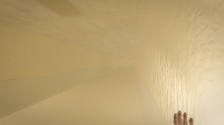
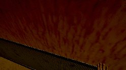
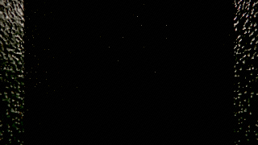
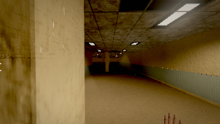
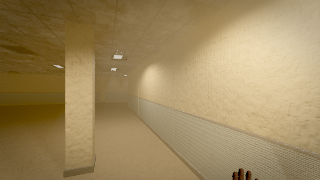

# Playthrough filmstrip

5 frames from one continuous 260 s session, in order.
Read it as a sequence: what changes between two frames 15 s apart is the pacing.

### 0:01.0 — arrival — standing still, taking the room in

### 1:01.0 — lamp on

### 2:01.0 — inside the locker — two louvre slots and your own breathing

### 3:01.0 — walk on, lamp off (the entity only moves in light)

### 4:01.0 — lamp on and keep moving (it only advances in light)

