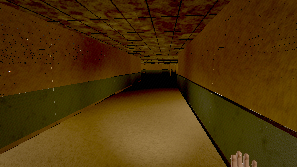
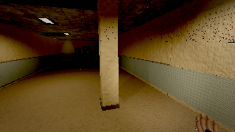
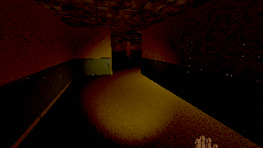
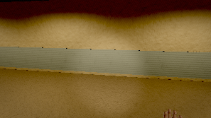
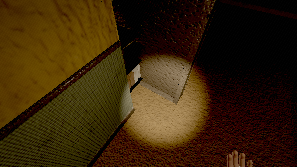
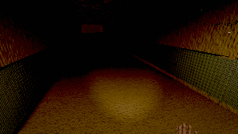
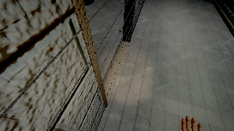
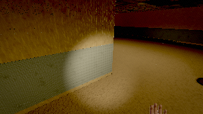
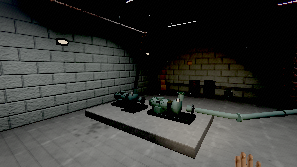
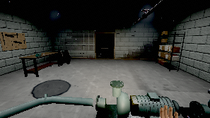

# THE ANNEX — an exploration bot, and what it could not find

Generated 2026-08-01T10:19:57.782Z by `tools/qa/explore.mjs`.

**32400 frames · 540.0 s of unguided play at a fixed 1/60 step · 241 s of wall clock · quality `low` · 480×270 · render 1 frame in 32**

This bot is given no route, no zone list, no interactable ids and no objectives. It steers
on line-of-sight probes into the collision world, prefers headings that lead somewhere it
has not stood, and presses the interact key only on frames where the game itself reports
something under the reticle. Every zone change in the timeline below happened because it
walked into a doorway and `World.update` fired the portal. Keys are real DOM events; mouse
look is written into `Input.mouse`, because headless Chromium cannot grant pointer lock.

The coverage denominator is built from `collision.floors`, which the bot never reads. The
ruler is allowed to know the size of the room; the walker is not.

## Assertions

| | check | detail |
|---|---|---|
| **FAIL** | no console errors during the session | The root document of this element is not valid for pointer lock. | The root document of this element is not valid for pointer lock. | The root document of this element is not valid for pointer lock. |
| **PASS** | player position never NaN | 0 frames |
| **PASS** | the bot never fell through the floor | y 0.00..0.00; 0 of 32400 frames off a floor (worst run 0) |
| **PASS** | the bot actually walked (averaged over 1 m of ground per second) | 3353 m in 540 s |
| **PASS** | the bot found and operated an interactable with no hint | note_-294_278, note_-301_271, battery_cell_-299_243, tape_player_-296_239, locker_intake_enter, intake_door2_use, intake_door0_use, service_door1_use, service_door1_use, service_door2_use, intake_door1_use |
| **PASS** | the bot got out of its starting zone unaided | 2 zone(s): intake → service |
| **PASS** | the starting zone is at least 25 % covered | intake: 39.8% of 857 walkable cells in 540 s |
| **PASS** | the bot was still finding new ground in the last quarter of the session | 26 new cells after 6:45.0 |
| **PASS** | the bot was not lost for more than a quarter of the session | longest stretch with nowhere new: 39.2 s (7% of the session) at (380.0, 0.0, -0.3) in service |
| **FAIL** | less than half the session had no navigational cue in sight | 74.4% of samples had nothing to walk toward |
| **PASS** | no single stall lasted longer than 60 s | worst 19 s at (383.5, 0.0, 0.2) in service |
| **FAIL** | an objective completed without hints | no objective completed in the whole session |
| **PASS** | the session never sat on the death screen | 0 of 540 samples dead; 4 revive(s) |
| **PASS** | the session did not get stuck inside a hiding place | 301 of 32400 frames hidden |

**3 check(s) failed.** They are findings, not tool errors — see below.

## The headline numbers

| | |
|---|---|
| Time to first objective, no hints | **never** — no objective completed in the session |
| Walkable area visited | **42.9%** of 903 cells of 2 m across the zones it reached |
| Revisit rate | **32.8%** — 190 of 579 cell entries were somewhere it had already been |
| Longest stretch with nowhere new | **39.2 s** (8:10.3 → 8:49.5), at (380.0, 0.0, -0.3) in `service` |
| No navigational cue in sight | **74.4%** of the session (402 s), longest run 99 s |
| Zones reached | **2 of 8** — intake, service |
| Ground covered | 3353 m |
| Interactables operated | 11 operated, 0 refused, 2 seen but never reached |
| Locked-door refusals walked into | 1 |
| Times it had to shove itself out of a corner | 9 |

## Per zone

| zone | time | visits | coverage | cells | revisit | no cue | worst lost | operated | locked |
|---|---:|---:|---:|---:|---:|---:|---:|---:|---:|
| `intake` | 380 s | 4 | 39.8% | 341/857 | 22.2% | 82.4% | 16.3 s | 9 | 0 |
| `service` | 160 s | 4 | 100.0% | 49/46 | 65.5% | 55.6% | 26.5 s | 6 | 1 |

`coverage` is 2 m × 2 m × 3 m cells of walkable floor the bot physically stood in, over every
such cell in the zone that a body fits in. A zone with a high revisit rate and low coverage is
a zone the bot walked in circles in. `worst lost` is the longest stretch **inside one visit to
that zone** with no new cell found — not the time between two visits, which is a number about
somewhere else.

**A 2 m grid is coarse for a corridor.** A cell whose centre lands in a wall is dropped from
the denominator, so a zone made of 1.8 m spines loses proportionally more of its floor to the
grid than a zone made of halls does, and its coverage percentage reads high for that reason
alone. Compare a zone against itself across builds; do not rank zones against each other on
this column.

## Where it got lost

Stretches with no new cell discovered. Long ones are rooms without a way on.

| from | to | seconds | zone | last new ground |
|---|---|---:|---|---|
| 8:10.3 | 8:49.5 | 39.2 | `service` | (380.0, 0.0, -0.3) |
| 7:00.0 | 7:24.6 | 24.6 | `service` | (390.3, 0.0, 0.0) |
| 7:31.2 | 7:54.0 | 22.8 | `service` | (384.0, 0.0, 0.1) |
| 3:27.9 | 3:44.2 | 16.3 | `intake` | (-12.0, 0.0, 15.9) |
| 1:14.3 | 1:26.7 | 12.4 | `intake` | (-12.0, 0.0, 27.1) |
| 8:49.5 | 9:00.0 | 10.5 | `service` | (372.5, 0.0, -12.0) *(ran out the clock)* |
| 1:05.1 | 1:13.3 | 8.2 | `intake` | (-24.0, 0.0, 26.8) |
| 6:33.0 | 6:41.0 | 8.0 | `service` | (378.0, 0.0, -1.8) |

## Where it stalled

Stayed inside a 1.6 m radius for at least 12 s.

| from | seconds | zone | position | note |
|---|---:|---|---|---|
| 7:31.0 | 19 | `service` | (383.5, 0.0, 0.2) | walking into something |
| 7:07.0 | 18 | `service` | (369.9, 0.0, 0.0) | walking into something |

## Without a cue

402 s (74.4%) with no interactable and no door on screen or in reach.

| from | seconds | zone | position |
|---|---:|---|---|
| 1:28.0 | 99 | `intake` | (-29.4, 0.0, 21.2) |
| 4:06.0 | 85 | `intake` | (-5.7, 0.0, 14.2) |
| 3:12.0 | 43 | `intake` | (-28.1, 0.0, 18.7) |
| 0:53.0 | 31 | `intake` | (-30.1, 0.0, 31.1) |
| 8:08.0 | 18 | `service` | (375.2, 0.0, 0.1) |
| 7:33.0 | 16 | `service` | (384.7, 0.0, 0.8) |
| 0:01.0 | 14 | `intake` | (-17.8, 0.0, 24.0) |
| 5:41.0 | 13 | `intake` | (4.6, 0.0, -17.7) |

The cue metric showing its working — why candidate objects were culled from view, summed
over every scan of the session:

```json
{"far":108092,"behind":8606,"elevation":11,"occluded":4438,"hidden":0,"seen":1837}
```

If `occluded` were everything and `seen` were zero, the sightline test would be broken
rather than the level being empty. That is not a hypothetical: it was the first result
this tool produced, because a ray drawn to a door ends inside the door's own collider.

## What it operated, and what it could not

| at | id | kind | approach | result |
|---|---|---|---:|---|
| 0:22.6 | `note_-294_278` | pickup | 8.4 s | operated |
| 0:25.5 | `note_-301_271` | pickup | 2.9 s | operated |
| 0:26.9 | `battery_cell_-299_243` | pickup | 1.4 s | operated |
| 0:29.7 | `tape_player_-296_239` | pickup | 2.8 s | operated |
| 0:44.7 | `locker_intake_enter` | hide | 3.8 s | operated |
| 4:02.8 | `intake_door2_use` | door | 8.6 s | operated |
| 5:39.5 | `intake_door0_use` | door | 8.5 s | operated |
| 5:59.0 | `intake_door1_use` | door | — | abandoned — left the zone it was in |
| 6:06.9 | `service_door1_use` | door | 7.9 s | operated |
| 6:36.8 | `service_door1_use` | door | 3.9 s | operated |
| 6:58.1 | `service_door2_use` | door | 1.2 s | operated |
| 7:22.8 | `service_door1_use` | door | — | gave up — could not reach it |
| 7:47.4 | `service_door2_use` | door | — | gave up — could not reach it |
| 7:55.9 | `service_door0_use` | door | — | abandoned — left the zone it was in |
| 8:05.3 | `intake_door1_use` | door | 3.7 s | operated |

Registry: 48 interactables and 16 door latches were resident at the end.
Objective state: `{"objective":"reach_plant","completed":0,"cores":{"found":0,"fitted":0},"running":false,"ended":null,"gates":["arrival_lift","to_cistern_pipes","to_stack","to_residence","to_plant"],"discoveries":[]}`
Carried: `{"items":{"lamp":1,"battery_cell":2},"selected":"lamp"}`

## The route it actually took

```
  0:00.0  intake
  5:59.0  service
  7:00.7  intake
  7:06.7  service
  7:55.9  intake
  8:05.4  service
  8:17.0  intake
  8:23.0  service
```

## Timeline

State every 10 s, plus every event that was not a footstep.

```
  0:01.0  intake    pos(  -17.8,    0.0,   24.0) cells    2 lost   0s cue  0 explore  walk light  36.2 lamp 
  0:11.0  intake    pos(   -8.8,    0.0,   28.3) cells   16 lost   0s cue  0 explore  walk light  29.7 lamp 
  0:19.9      * director:entity-placed 
  0:21.0  intake    pos(  -28.1,    0.0,   27.9) cells   27 lost   1s cue  3 approach stil light  25.1 lamp DORMANT
  0:22.6      * story:note             id=nb_1 kind=notebook title=Notebook — first page
  0:22.6      * pickup:taken           id=note_-294_278 item=note
  0:22.6      * interact:use           id=note_-294_278 kind=pickup
  0:25.5      * story:note             id=note_induction kind=form title=Contractor Induction — Annex 7
  0:25.5      * pickup:taken           id=note_-301_271 item=note
  0:25.5      * interact:use           id=note_-301_271 kind=pickup
  0:26.9      * item:pickup            id=battery_cell kind=battery name=Spare cell
  0:26.9      * pickup:taken           id=battery_cell_-299_243 item=battery_cell
  0:26.9      * interact:use           id=battery_cell_-299_243 kind=pickup
  0:31.0  intake    pos(  -31.0,    0.0,   23.0) cells   30 lost   1s cue  0 explore  walk light  24.1 lamp DORMANT
  0:41.0  intake    pos(  -25.4,    0.0,   21.4) cells   41 lost   1s cue  2 approach walk light  36.8 lamp DORMANT
  0:44.7      * hide:enter             id=locker_intake kind=locker
  0:44.7      * interact:use           id=locker_intake_enter kind=hide
  0:49.7      * hide:exit              id=locker_intake kind=locker
  0:49.7      * interact:use           id=locker_intake_enter kind=hide
  0:51.0  intake    pos(  -29.9,    0.0,   28.5) cells   46 lost   1s cue  1 explore  stil light  20.9 lamp DORMANT
  0:59.4      * entity:state           from=DORMANT state=ROUSED
  0:59.4      * entity:heard           
  0:59.8      * entity:heard           
  1:00.3      * entity:heard           
  1:00.7      * entity:heard           
  1:01.0  intake    pos(  -16.2,    0.0,   27.8) cells   56 lost   0s cue  0 explore  walk light  32.7 lamp ROUSED
  1:01.2      * entity:heard           
  1:01.6      * entity:heard           
  1:02.9      * entity:state           from=ROUSED state=SEEKING
  1:09.5      * entity:heard           
  1:09.9      * entity:heard           
  1:10.3      * entity:heard           
  1:10.8      * entity:heard           
  1:11.0  intake    pos(  -18.5,    0.0,   29.0) cells   60 lost   6s cue  0 explore  walk light  30.2 lamp SEEKING
  1:11.2      * entity:heard           
  1:11.7      * entity:heard           
  1:11.7      * entity:state           from=SEEKING state=APPROACHING
  1:12.1      * entity:heard           
  1:12.6      * entity:heard           
  1:13.0      * entity:heard           
  1:13.5      * entity:heard           
  1:13.6      * entity:state           from=APPROACHING state=CAPTURING
  1:15.0      * game:death             cause=surveyor
  1:15.0      * cine:begin             name=death cause=surveyor
  1:15.0      * ui:action              
  1:15.0      * entity:state           from=CAPTURING state=DORMANT
  1:15.0      * cine:end               name=death
  1:15.0      * game:respawn           
  1:15.0      * cine:begin             name=respawn
  1:15.0      * ui:screen              
  1:15.0      * light:circuit          circuit=office_lamp powered=true
  1:15.1      * cine:cue               
  1:15.6      * cine:cue               
  1:18.2      * cine:cue               
  1:19.2      * death:settled          
  1:21.0  intake    pos(  -24.0,    0.0,   25.2) cells   62 lost   7s cue  0 explore  walk light  33.5 lamp DORMANT
  1:23.6      * ui:screen              
  1:23.6      * game:respawn           
  1:23.6      * cine:end               name=respawn
  1:31.0  intake    pos(  -28.4,    0.0,   15.0) cells   66 lost   1s cue  0 explore  walk light  35.8 lamp DORMANT
  1:41.0  intake    pos(  -27.1,    0.0,    3.6) cells   79 lost   0s cue  0 explore  walk light  32.0 lamp DORMANT
  1:51.0  intake    pos(  -19.0,    0.0,  -10.0) cells   90 lost   1s cue  0 explore  stil light  32.8 lamp DORMANT
  2:01.0  intake    pos(  -13.4,    0.0,  -15.3) cells  101 lost   0s cue  0 explore  walk light  18.5 lamp DORMANT
  2:11.0  intake    pos(   -8.5,    0.0,   -7.6) cells  115 lost   0s cue  0 explore  walk light  31.6 lamp DORMANT
  2:21.0  intake    pos(   -8.6,    0.0,   -8.1) cells  125 lost   1s cue  0 explore  walk light  31.8 lamp DORMANT
  2:31.0  intake    pos(   -6.6,    0.0,   -8.7) cells  132 lost   3s cue  0 explore  walk light  31.9 lamp DORMANT
  2:41.0  intake    pos(    4.3,    0.0,   -5.4) cells  143 lost   0s cue  0 explore  walk light  34.8 lamp DORMANT
  2:51.0  intake    pos(  -13.3,    0.0,   -3.8) cells  155 lost   1s cue  0 explore  walk light  25.4 lamp DORMANT
  2:51.2      * director:beat          zone=intake name=distant_door
  2:51.2      * sfx:distant            kind=door
  2:51.2      * entity:state           from=DORMANT state=ROUSED
  2:51.2      * entity:heard           
  2:54.7      * entity:state           from=ROUSED state=SEEKING
  3:01.0  intake    pos(  -28.1,    0.0,   -1.9) cells  164 lost   1s cue  0 explore  walk light  28.7 lamp SEEKING
  3:02.7      * entity:state           from=SEEKING state=MEASURING
  3:10.9      * entity:state           from=MEASURING state=SEEKING
  3:11.0  intake    pos(  -29.8,    0.0,   17.4) cells  173 lost   1s cue  1 explore  walk light  28.7 lamp SEEKING
  3:14.2      * entity:state           from=SEEKING state=MEASURING
  3:21.0  intake    pos(  -23.9,    0.0,   10.7) cells  181 lost   0s cue  0 explore  walk light  44.0 lamp MEASURING
  3:22.9      * entity:heard           
  3:23.0      * entity:state           from=MEASURING state=SEEKING
  3:23.3      * entity:heard           
  3:23.8      * entity:heard           
  3:24.2      * entity:heard           
  3:24.7      * entity:heard           
  3:25.1      * entity:heard           
  3:25.1      * entity:state           from=SEEKING state=APPROACHING
  3:25.6      * entity:heard           
  3:26.0      * entity:heard           
  3:26.5      * entity:heard           
  3:26.9      * entity:state           from=APPROACHING state=CAPTURING
  3:28.2      * game:death             cause=surveyor
  3:28.2      * cine:begin             name=death cause=surveyor
  3:28.2      * ui:action              
  3:28.2      * entity:state           from=CAPTURING state=DORMANT
  3:28.2      * cine:end               name=death
  3:28.2      * game:respawn           
  3:28.2      * cine:begin             name=respawn
  3:28.2      * ui:screen              
  3:28.3      * light:circuit          circuit=office_lamp powered=true
  3:28.3      * cine:cue               
  3:28.8      * cine:cue               
  3:31.0  intake    pos(  -24.0,    0.0,   25.2) cells  191 lost   3s cue  0 explore  stil light  33.5 lamp DORMANT
  3:31.4      * cine:cue               
  3:32.4      * death:settled          
  3:36.8      * ui:screen              
  3:36.8      * game:respawn           
  3:36.8      * cine:end               name=respawn
  3:41.0  intake    pos(  -22.6,    0.0,   28.6) cells  191 lost  13s cue  0 explore  walk light  28.6 lamp DORMANT
  3:48.1      * entity:state           from=DORMANT state=ROUSED
  3:48.1      * entity:heard           
  3:48.5      * entity:heard           
  3:49.0      * entity:heard           
  3:49.4      * entity:heard           
  3:49.9      * entity:heard           
  3:50.3      * entity:heard           
  3:50.7      * entity:heard           
  3:51.0  intake    pos(   -1.6,    0.0,   29.0) cells  198 lost   0s cue  0 explore  walk light  22.8 lamp ROUSED
  3:51.2      * entity:heard           
  3:51.6      * entity:state           from=ROUSED state=SEEKING
  3:51.6      * entity:state           from=SEEKING state=APPROACHING
  3:51.7      * entity:heard           
  3:52.1      * entity:heard           
  3:52.6      * entity:heard           
  3:53.0      * entity:heard           
  3:53.5      * entity:heard           
  3:53.9      * entity:heard           
  3:54.4      * entity:heard           
  3:54.8      * entity:heard           
  3:55.3      * entity:heard           
  3:55.7      * entity:heard           
  3:56.2      * entity:heard           
  3:56.6      * entity:heard           
  3:57.1      * entity:heard           
  3:57.5      * entity:heard           
  3:58.0      * entity:heard           
  4:01.0  intake    pos(   -5.6,    0.0,   13.2) cells  210 lost   1s cue  1 approach stil light  29.3 lamp APPROACHING
  4:02.8      * door:state             state=opening id=intake_door2
  4:02.8      * interact:use           id=intake_door2_use kind=door
  4:03.5      * door:state             state=open id=intake_door2
  4:04.4      * entity:state           from=APPROACHING state=MEASURING
  4:10.4      * entity:state           from=MEASURING state=SEEKING
  4:11.0  intake    pos(  -14.4,    0.0,   18.4) cells  219 lost   0s cue  0 explore  walk light  40.8 lamp SEEKING
  4:13.7      * entity:state           from=SEEKING state=MEASURING
  4:20.3      * entity:state           from=MEASURING state=SEEKING
  4:21.0  intake    pos(  -17.6,    0.0,   14.6) cells  229 lost   3s cue  0 explore  walk light  44.6 lamp SEEKING
  4:23.6      * entity:state           from=SEEKING state=MEASURING
  4:28.0      * entity:state           from=MEASURING state=RETREATING
  4:31.0  intake    pos(  -20.3,    0.0,   19.3) cells  236 lost   1s cue  0 explore  walk light  45.1 lamp RETREATING
  4:32.2      * entity:state           from=RETREATING state=ROUSED
  4:32.2      * entity:heard           
  4:32.7      * entity:heard           
  4:33.1      * entity:heard           
  4:33.6      * entity:heard           
  4:34.0      * entity:heard           
  4:34.5      * entity:heard           
  4:34.9      * entity:heard           
  4:35.4      * entity:heard           
  4:35.7      * entity:state           from=ROUSED state=SEEKING
  4:35.8      * entity:heard           
  4:36.3      * entity:heard           
  4:36.7      * entity:heard           
  4:37.1      * entity:heard           
  4:37.6      * entity:heard           
  4:38.0      * entity:heard           
  4:41.0  intake    pos(   -0.1,    0.0,   16.6) cells  245 lost   1s cue  0 explore  walk light  35.0 lamp SEEKING
  4:47.8      * entity:state           from=SEEKING state=MEASURING
  4:51.0  intake    pos(   12.1,    0.0,   18.4) cells  257 lost   1s cue  0 explore  walk light  37.5 lamp MEASURING
  4:53.6      * entity:state           from=MEASURING state=SEEKING
  4:56.9      * entity:state           from=SEEKING state=MEASURING
  5:01.0  intake    pos(   -0.8,    0.0,    7.0) cells  270 lost   0s cue  0 explore  walk light  25.4 lamp MEASURING
  5:04.2      * entity:state           from=MEASURING state=SEEKING
  5:07.5      * entity:state           from=SEEKING state=MEASURING
  5:11.0  intake    pos(  -20.4,    0.0,    7.1) cells  280 lost   1s cue  0 explore  walk light  33.1 lamp MEASURING
  5:14.7      * entity:state           from=MEASURING state=RETREATING
  5:21.0  intake    pos(  -10.6,    0.0,    1.6) cells  292 lost   1s cue  0 explore  walk light  14.0 lamp RETREATING
  5:31.0  intake    pos(    6.1,    0.0,   -5.1) cells  305 lost   0s cue  1 explore  walk light  35.0 lamp RETREATING
  5:32.7      * entity:state           from=RETREATING state=DORMANT
  5:39.5      * door:state             state=opening id=intake_door0
  5:39.5      * interact:use           id=intake_door0_use kind=door
  5:40.2      * door:state             state=open id=intake_door0
  5:41.0  intake    pos(    4.6,    0.0,  -17.7) cells  312 lost   0s cue  0 explore  walk light  14.7 lamp DORMANT
  5:51.0  intake    pos(   13.4,    0.0,   -6.9) cells  321 lost   1s cue  0 explore  walk light  31.7 lamp DORMANT
  5:52.9      * zone:build             zone=service
  5:53.6      * director:beat          zone=intake name=services
  5:53.6      * sfx:services           kind=water
  5:59.0      * zone:leave             zone=intake
  5:59.0      * world:teleport         zone=service kind=door
  5:59.0      * zone:enter             zone=service from=intake
  5:59.0      * director:entity-followed zone=service
  5:59.9      * zone:build             zone=cistern
  6:01.0  service   pos(  373.3,    0.0,   -1.0) cells  336 lost   1s cue  1 approach stil light  22.6 lamp DORMANT
  6:06.9      * door:state             state=closing id=service_door1
  6:06.9      * interact:use           id=service_door1_use kind=door
  6:07.8      * door:state             state=closed id=service_door1
  6:11.0  service   pos(  374.9,    0.0,   -8.0) cells  343 lost   0s cue  0 explore  walk light  22.8 lamp DORMANT
  6:21.0  service   pos(  372.8,    0.0,   -4.8) cells  350 lost   1s cue  0 explore  walk light  24.4 lamp DORMANT
  6:27.1      * portal:locked          zone=cistern id=to_cistern_pipes
  6:31.0  service   pos(  378.2,    0.0,   -5.9) cells  358 lost   0s cue  0 explore  walk light  22.2 lamp DORMANT
  6:36.8      * door:state             state=opening id=service_door1
  6:36.8      * interact:use           id=service_door1_use kind=door
  6:37.5      * door:state             state=open id=service_door1
  6:41.0  service   pos(  376.2,    0.0,   -4.0) cells  361 lost   8s cue  1 explore  walk light  25.0 lamp DORMANT
  6:51.0  service   pos(  373.0,    0.0,   -1.7) cells  364 lost   5s cue  1 explore  walk light  22.8 lamp DORMANT
  6:53.7      * entity:state           from=DORMANT state=ROUSED
  6:53.7      * entity:heard           
  6:54.2      * entity:heard           
  6:54.6      * entity:heard           
  6:55.1      * entity:heard           
  6:55.5      * entity:heard           
  6:56.0      * entity:heard           
  6:56.4      * entity:heard           
  6:56.9      * entity:heard           
  6:57.2      * entity:state           from=ROUSED state=SEEKING
  6:57.2      * entity:state           from=SEEKING state=APPROACHING
  6:57.4      * entity:heard           
  6:57.9      * entity:heard           
  6:58.1      * entity:heard           
  6:58.1      * door:state             state=closing id=service_door2
  6:58.1      * interact:use           id=service_door2_use kind=door
  6:58.3      * entity:heard           
  6:58.8      * entity:heard           
  6:59.0      * door:state             state=closed id=service_door2
  6:59.3      * entity:heard           
  6:59.3      * entity:state           from=APPROACHING state=CAPTURING
  7:00.6      * game:death             cause=surveyor
  7:00.6      * cine:begin             name=death cause=surveyor
  7:00.7      * ui:action              
  7:00.7      * entity:state           from=CAPTURING state=DORMANT
  7:00.7      * attendant:act          kind=locker
  7:00.7      * cine:end               name=death
  7:00.7      * game:respawn           
  7:00.7      * cine:begin             name=respawn
  7:00.7      * zone:leave             zone=service
  7:00.7      * world:teleport         zone=intake kind=door
  7:00.7      * zone:enter             zone=intake from=service
  7:00.7      * director:entity-followed zone=intake
  7:00.7      * ui:screen              
  7:00.7      * light:circuit          circuit=office_lamp powered=true
  7:00.8      * cine:cue               
  7:01.0  intake    pos(   29.7,    0.0,   -8.4) cells  375 lost   1s cue  0 explore  stil light  20.6 lamp DORMANT
  7:01.2      * cine:cue               
  7:03.9      * cine:cue               
  7:04.8      * death:settled          
  7:06.7      * zone:leave             zone=intake
  7:06.7      * zone:enter             zone=service from=intake
  7:06.7      * director:entity-followed zone=service
  7:09.2      * ui:screen              
  7:09.2      * game:respawn           
  7:09.2      * cine:end               name=respawn
  7:11.0  service   pos(  369.9,    0.0,    0.0) cells  375 lost  11s cue  1 approach stil light  15.2 lamp DORMANT
  7:21.0  service   pos(  369.9,    0.0,    0.0) cells  375 lost  21s cue  1 approach stil light  16.3 lamp DORMANT
  7:29.8      * entity:state           from=DORMANT state=ROUSED
  7:29.8      * entity:heard           
  7:30.3      * entity:heard           
  7:30.7      * entity:heard           
  7:31.0  service   pos(  383.5,    0.0,    0.2) cells  377 lost   4s cue  0 explore  walk light  23.9 lamp ROUSED
  7:31.1      * entity:heard           
  7:31.7      * entity:heard           
  7:33.3      * entity:state           from=ROUSED state=SEEKING
  7:36.9      * entity:state           from=SEEKING state=APPROACHING
  7:41.0  service   pos(  384.7,    0.0,    1.0) cells  378 lost  10s cue  0 approach stil light  24.1 lamp APPROACHING
  7:42.3      * entity:state           from=APPROACHING state=MEASURING
  7:48.9      * entity:heard           
  7:49.4      * entity:heard           
  7:49.5      * entity:state           from=MEASURING state=SEEKING
  7:49.5      * entity:state           from=SEEKING state=APPROACHING
  7:49.9      * entity:heard           
  7:50.3      * entity:heard           
  7:50.8      * entity:heard           
  7:51.0  service   pos(  380.2,    0.0,    0.4) cells  378 lost  20s cue  2 approach walk light  23.3 lamp APPROACHING
  7:51.2      * entity:heard           
  7:51.7      * entity:heard           
  7:52.2      * entity:heard           
  7:52.6      * entity:heard           
  7:53.1      * entity:heard           
  7:53.5      * entity:heard           
  7:54.0      * entity:heard           
  7:54.4      * entity:heard           
  7:54.9      * entity:heard           
  7:55.3      * entity:heard           
  7:55.8      * entity:heard           
  7:55.9      * zone:leave             zone=service
  7:55.9      * world:teleport         zone=intake kind=door
  7:55.9      * zone:enter             zone=intake from=service
  7:55.9      * entity:state           from=APPROACHING state=DORMANT
  7:55.9      * director:entity-followed zone=intake
  7:55.9      * entity:state           from=DORMANT state=ROUSED
  7:59.4      * entity:state           from=ROUSED state=SEEKING
  8:01.0  intake    pos(   21.3,    0.0,  -10.8) cells  384 lost   0s cue  0 explore  walk light  24.5 lamp SEEKING
  8:05.3      * door:state             state=closing id=intake_door1
  8:05.3      * interact:use           id=intake_door1_use kind=door
  8:05.4      * zone:leave             zone=intake
  8:05.4      * world:teleport         zone=service kind=door
  8:05.4      * zone:enter             zone=service from=intake
  8:05.4      * entity:state           from=SEEKING state=DORMANT
  8:05.4      * director:entity-followed zone=service
  8:05.9      * door:state             state=closed id=intake_door1
  8:08.4      * entity:state           from=DORMANT state=ROUSED
  8:08.4      * entity:heard           
  8:08.8      * entity:heard           
  8:09.3      * entity:heard           
  8:09.7      * entity:heard           
  8:10.2      * entity:heard           
  8:11.0  service   pos(  380.3,    0.0,   -0.5) cells  388 lost   1s cue  0 explore  walk light  23.3 lamp ROUSED
  8:11.6      * entity:heard           
  8:11.9      * entity:state           from=ROUSED state=SEEKING
  8:12.1      * entity:heard           
  8:12.6      * entity:heard           
  8:13.1      * entity:state           from=SEEKING state=APPROACHING
  8:13.1      * entity:heard           
  8:13.5      * entity:heard           
  8:14.0      * entity:heard           
  8:14.5      * entity:heard           
  8:14.9      * entity:heard           
  8:15.6      * entity:state           from=APPROACHING state=CAPTURING
  8:17.0      * game:death             cause=surveyor
  8:17.0      * cine:begin             name=death cause=surveyor
  8:17.0      * ui:action              
  8:17.0      * entity:state           from=CAPTURING state=DORMANT
  8:17.0      * attendant:act          kind=locker
  8:17.0      * cine:end               name=death
  8:17.0      * game:respawn           
  8:17.0      * cine:begin             name=respawn
  8:17.0      * zone:leave             zone=service
  8:17.0      * world:teleport         zone=intake kind=door
  8:17.0      * zone:enter             zone=intake from=service
  8:17.0      * director:entity-followed zone=intake
  8:17.0      * ui:screen              
  8:17.0      * light:circuit          circuit=office_lamp powered=true
  8:17.1      * cine:cue               
  8:17.6      * cine:cue               
  8:20.2      * cine:cue               
  8:21.0  intake    pos(   29.7,    0.0,   -8.4) cells  388 lost  11s cue  0 explore  stil light  20.2 lamp DORMANT
  8:21.2      * death:settled          
  8:23.0      * zone:leave             zone=intake
  8:23.0      * zone:enter             zone=service from=intake
  8:23.0      * director:entity-followed zone=service
  8:25.6      * ui:screen              
  8:25.6      * game:respawn           
  8:25.6      * cine:end               name=respawn
  8:31.0  service   pos(  374.0,    0.0,   -0.8) cells  388 lost  21s cue  2 explore  walk light  22.6 lamp DORMANT
  8:41.0  service   pos(  374.5,    0.0,   -1.6) cells  388 lost  31s cue  1 explore  walk light  22.8 lamp DORMANT
  8:51.0  service   pos(  373.1,    0.0,  -12.1) cells  389 lost   2s cue  0 explore  stil light  14.4 lamp DORMANT
```

## Event census

| event | count |
|---|---:|
| `entity:heard` | 111 |
| `entity:state` | 52 |
| `cine:cue` | 12 |
| `door:state` | 12 |
| `interact:use` | 11 |
| `cine:begin` | 8 |
| `cine:end` | 8 |
| `game:respawn` | 8 |
| `ui:screen` | 8 |
| `zone:leave` | 7 |
| `zone:enter` | 7 |
| `director:entity-followed` | 7 |
| `world:teleport` | 5 |
| `game:death` | 4 |
| `ui:action` | 4 |
| `light:circuit` | 4 |
| `death:settled` | 4 |
| `pickup:taken` | 3 |
| `story:note` | 2 |
| `director:beat` | 2 |
| `zone:build` | 2 |
| `attendant:act` | 2 |
| `director:entity-placed` | 1 |
| `item:pickup` | 1 |
| `hide:enter` | 1 |
| `hide:exit` | 1 |
| `sfx:distant` | 1 |
| `sfx:services` | 1 |
| `portal:locked` | 1 |

## Filmstrip

11 frames — one every ~60 s, plus one every time the bot had gone 
25 s without finding anywhere new. The `LOST` frames are the ones to look at.

### 0:01.0 — intake exploring



### 1:01.0 — intake exploring



### 2:01.0 — intake exploring



### 3:01.0 — intake exploring



### 4:01.0 — intake exploring



### 5:01.0 — intake exploring



### 6:01.0 — service exploring



### 7:01.0 — intake exploring


### 8:01.0 — intake exploring



### 8:36.0 — LOST 26s in service



### 9:00.0 — final frame



## What this tool cannot tell you

- It is a bot. It has no curiosity, cannot read a note, and does not form a hypothesis about
  where a corridor goes. A human is better at this and will get lost in different places.
- **A "cue" here is an interactable or a door, and nothing else.** Room plates, `STAFF ONLY`
  labels, wear paths worn into the lino, a lit corridor at the end of a dark one and the
  shape of the architecture itself are all navigational cues this tool is blind to. The
  cueless figure is therefore an **upper bound** on how lost a player would feel, not a
  measurement of it. What it is good for is comparison between zones and between builds.
- It steers on collision geometry, not on the rendered image, so a corridor that is visually
  unreadable but geometrically open reads as findable here. It cannot measure "too dark to
  navigate"; `tools/qa/emissive.mjs` and the capture harnesses do that.
- Frame times are SwiftShader and are not a frame-rate verdict.
- Coverage counts every walkable cell in a zone, including rooms behind doors this run never
  unlocked. It is "how much of the floor did it stand on", not "how much of the floor was
  reachable in this session". It is also a function of how long the session ran.
- One run is one route. The steering is seeded (`--seed`), so a run repeats; a *different*
  seed is a different walk and the numbers will move. Treat a single run as one playtester,
  not as the truth about the building.

## Checking the ruler

Two modes exist so that none of the above has to be taken on trust:

```
node tools/qa/explore.mjs --selftest
node tools/qa/explore.mjs --verify docs/verification/explore/explore.json
```

`--selftest` runs every metric function against states whose answers are known by
construction — including the two shapes this repo has shipped before: a coverage figure that
cannot go down, and a "longest quiet stretch" seeded with the whole session so that no real
gap can ever beat it (`docs/PLAYTEST_2026-07-31.md` §7). `--verify` re-derives every headline
number above from the stored record, confirms it reproduces, then truncates the session to
25/50/75 % and requires the coverage to fall and the lost time to change. A metric that does
not move when the session is cut in half is not measuring the session.
