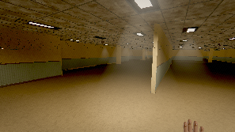
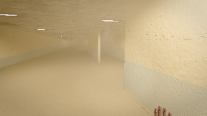
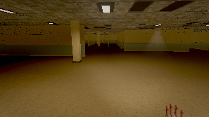
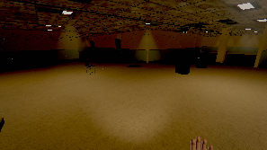
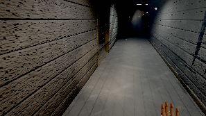
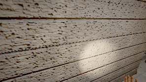
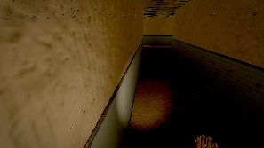
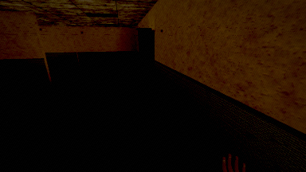
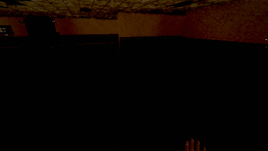
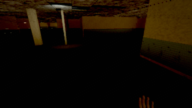

# THE ANNEX — an exploration bot, and what it could not find

Generated 2026-08-14T01:54:00.674Z by `tools/qa/explore.mjs`.

**32400 frames · 540.0 s of unguided play at a fixed 1/60 step · 285 s of wall clock · quality `low` · 480×270 · render 1 frame in 32**

This bot is given no route, no zone list, no interactable ids and no objectives. It steers
on line-of-sight probes into the collision world, prefers headings that lead somewhere it
has not stood, and presses the interact key only on frames where the game itself reports
something under the reticle. Every zone change in the timeline below happened because it
walked into a doorway and `World.update` fired the portal. Keys are real DOM events; mouse
look is written into `Input.mouse`, because headless Chromium cannot grant pointer lock.

The coverage denominator is built from `collision.floors`, which the bot never reads. The
ruler is allowed to know the size of the room; the walker is not.

## Assertions

| | check | detail |
|---|---|---|
| **FAIL** | no console errors during the session | The root document of this element is not valid for pointer lock. | The root document of this element is not valid for pointer lock. |
| **PASS** | player position never NaN | 0 frames |
| **PASS** | the bot never fell through the floor | y 0.00..0.00; 0 of 32400 frames off a floor (worst run 0) |
| **PASS** | the bot actually walked (averaged over 1 m of ground per second) | 2394 m in 540 s |
| **PASS** | the bot found and operated an interactable with no hint | note_-294_278, note_-301_271, battery_cell_-299_243, tape_player_-296_239, locker_intake_enter, sw_intake_4_flip, intake_door3_use, sw_intake_0_flip, intake_door0_use, intake_door0_use, service_door1_use, service_door1_use, sw_intake_2_flip, intake_door5_use, intake_door0_use, intake_door3_use |
| **PASS** | the bot got out of its starting zone unaided | 2 zone(s): intake → service |
| **PASS** | the starting zone is at least 25 % covered | intake: 50.4% of 863 walkable cells in 540 s |
| **PASS** | the bot was still finding new ground in the last quarter of the session | 84 new cells after 6:45.0 |
| **PASS** | the bot was not lost for more than a quarter of the session | longest stretch with nowhere new: 11.5 s (2% of the session) at (10.3, 0.0, 26.0) in intake |
| **FAIL** | less than half the session had no navigational cue in sight | 77.0% of samples had nothing to walk toward |
| **PASS** | no single stall lasted longer than 60 s | no stalls |
| **FAIL** | an objective completed without hints | no objective completed in the whole session |
| **PASS** | the session never sat on the death screen | 0 of 540 samples dead; 2 revive(s) |
| **PASS** | the session did not get stuck inside a hiding place | 301 of 32400 frames hidden |

**3 check(s) failed.** They are findings, not tool errors — see below.

## The headline numbers

| | |
|---|---|
| Time to first objective, no hints | **never** — no objective completed in the session |
| Walkable area visited | **52.1%** of 909 cells of 2 m across the zones it reached |
| Revisit rate | **23.8%** — 148 of 621 cell entries were somewhere it had already been |
| Longest stretch with nowhere new | **11.5 s** (8:37.5 → 8:48.9), at (10.3, 0.0, 26.0) in `intake` |
| No navigational cue in sight | **77.0%** of the session (416 s), longest run 69 s |
| ...counting lit exit signs too | **44.3%** (239 s), longest run 23 s |
| Zones reached | **2 of 8** — intake, service |
| Ground covered | 2394 m |
| Interactables operated | 16 operated, 0 refused, 0 seen but never reached |
| Locked-door refusals walked into | 1 |
| Times it had to shove itself out of a corner | 3 |

## Per zone

| zone | time | visits | coverage | cells | revisit | no cue | worst lost | operated | locked |
|---|---:|---:|---:|---:|---:|---:|---:|---:|---:|
| `intake` | 480 s | 3 | 50.4% | 435/863 | 22.4% | 80.4% | 11.5 s | 15 | 0 |
| `service` | 60 s | 2 | 84.8% | 39/46 | 37.1% | 50.0% | 9.2 s | 4 | 1 |

`coverage` is 2 m × 2 m × 3 m cells of walkable floor the bot physically stood in, over every
such cell in the zone that a body fits in. A zone with a high revisit rate and low coverage is
a zone the bot walked in circles in. `worst lost` is the longest stretch **inside one visit to
that zone** with no new cell found — not the time between two visits, which is a number about
somewhere else.

**A 2 m grid is coarse for a corridor.** A cell whose centre lands in a wall is dropped from
the denominator, so a zone made of 1.8 m spines loses proportionally more of its floor to the
grid than a zone made of halls does, and its coverage percentage reads high for that reason
alone. Compare a zone against itself across builds; do not rank zones against each other on
this column.

## Where it got lost

Stretches with no new cell discovered. Long ones are rooms without a way on.

| from | to | seconds | zone | last new ground |
|---|---|---:|---|---|
| 8:37.5 | 8:48.9 | 11.5 | `intake` | (10.3, 0.0, 26.0) |
| 4:32.2 | 4:41.4 | 9.2 | `service` | (375.9, 0.0, -12.0) |
| 4:47.4 | 4:56.2 | 8.8 | `service` | (386.3, 0.0, 0.0) |
| 0:43.7 | 0:52.3 | 8.6 | `intake` | (-24.0, 0.0, 25.2) |
| 6:51.9 | 7:00.1 | 8.1 | `intake` | (-10.0, 0.0, 0.8) |
| 8:51.9 | 9:00.0 | 8.1 | `intake` | (16.0, 0.0, 30.3) *(ran out the clock)* |
| 8:03.1 | 8:11.0 | 7.9 | `intake` | (-20.0, 0.0, 20.6) |
| 0:17.2 | 0:23.7 | 6.5 | `intake` | (-28.0, 0.0, 27.8) |

## Where it stalled

No stall of 12 s or more inside a 1.6 m radius.

## Without a cue

416 s (77.0%) with no interactable and no door on screen or in reach.

| from | seconds | zone | position |
|---|---:|---|---|
| 5:39.0 | 69 | `intake` | (24.3, 0.0, 23.1) |
| 8:03.0 | 58 | `intake` | (-20.0, 0.0, 20.8) |
| 3:07.0 | 48 | `intake` | (-14.1, 0.0, -2.7) |
| 1:29.0 | 40 | `intake` | (-29.8, 0.0, 27.1) |
| 2:23.0 | 39 | `intake` | (-13.8, 0.0, -3.3) |
| 7:07.0 | 28 | `intake` | (-12.6, 0.0, 8.2) |
| 7:39.0 | 22 | `intake` | (-23.1, 0.0, 22.0) |
| 5:07.0 | 21 | `intake` | (28.7, 0.0, -7.6) |

The cue metric showing its working — why candidate objects were culled from view, summed
over every scan of the session:

```json
{"far":220778,"behind":10189,"elevation":10,"occluded":3082,"hidden":0,"seen":2315}
```

If `occluded` were everything and `seen` were zero, the sightline test would be broken
rather than the level being empty. That is not a hypothetical: it was the first result
this tool produced, because a ray drawn to a door ends inside the door's own collider.

## What it operated, and what it could not

| at | id | kind | approach | result |
|---|---|---|---:|---|
| 0:19.8 | `note_-294_278` | pickup | 8.4 s | operated |
| 0:22.8 | `note_-301_271` | pickup | 2.9 s | operated |
| 0:26.6 | `battery_cell_-299_243` | pickup | 3.9 s | operated |
| 0:27.2 | `tape_player_-296_239` | pickup | 0.5 s | operated |
| 1:20.2 | `locker_intake_enter` | hide | 5.8 s | operated |
| 2:14.6 | `sw_intake_4_flip` | switch | 6.0 s | operated |
| 2:15.1 | `intake_door3_use` | door | 0.5 s | operated |
| 2:18.7 | `sw_intake_0_flip` | switch | 3.6 s | operated |
| 2:21.8 | `intake_door0_use` | door | 3.1 s | operated |
| 3:06.3 | `intake_door0_use` | door | 5.2 s | operated |
| 4:00.4 | `intake_door2_use` | door | — | abandoned — left the zone it was in |
| 4:05.8 | `service_door1_use` | door | 5.4 s | operated |
| 4:40.2 | `service_door1_use` | door | 7.5 s | operated |
| 4:53.5 | `service_door2_use` | door | — | abandoned — left the zone it was in |
| 5:06.3 | `service_door0_use` | door | — | abandoned — left the zone it was in |
| 5:29.8 | `sw_intake_2_flip` | switch | 1.9 s | operated |
| 5:32.6 | `intake_door5_use` | door | 2.8 s | operated |
| 6:56.7 | `intake_door0_use` | door | 7.3 s | operated |
| 7:05.5 | `intake_door3_use` | door | 5.1 s | operated |

Registry: 58 interactables and 18 door latches were resident at the end.
Objective state: `{"objective":"reach_plant","completed":0,"cores":{"found":0,"fitted":0},"running":false,"ended":null,"gates":["arrival_lift","to_cistern_pipes","to_stack","to_residence","to_plant"],"discoveries":[]}`
Carried: `{"items":{"lamp":1,"battery_cell":1,"card_contractor":1},"selected":"lamp"}`

## The route it actually took

```
  0:00.0  intake
  4:00.4  service
  4:47.5  intake
  4:53.5  service
  5:06.3  intake
```

## Timeline

State every 10 s, plus every event that was not a footstep.

```
  0:01.0  intake    pos(  -18.9,    0.0,   21.7) cells    3 lost   0s cue  0 explore  walk light  54.5 lamp 
  0:11.0  intake    pos(  -14.8,    0.0,   28.1) cells   17 lost   0s cue  0 explore  walk light  41.5 lamp 
  0:19.8      * story:note             id=nb_1 kind=notebook title=Notebook — first page
  0:19.8      * pickup:taken           id=note_-294_278 item=note
  0:19.8      * interact:use           id=note_-294_278 kind=pickup
  0:19.9      * director:entity-placed 
  0:21.0  intake    pos(  -28.9,    0.0,   27.6) cells   25 lost   4s cue  2 approach stil light  27.9 lamp DORMANT
  0:22.8      * story:note             id=note_induction kind=form title=Contractor Induction — Annex 7
  0:22.8      * pickup:taken           id=note_-301_271 item=note
  0:22.8      * interact:use           id=note_-301_271 kind=pickup
  0:31.0  intake    pos(  -26.4,    0.0,   20.5) cells   31 lost   1s cue  0 explore  walk light  43.8 lamp DORMANT
  0:35.3      * entity:state           from=DORMANT state=ROUSED
  0:35.3      * entity:heard           
  0:35.8      * entity:heard           
  0:36.2      * entity:heard           
  0:36.7      * entity:heard           
  0:37.1      * entity:heard           
  0:37.6      * entity:heard           
  0:38.0      * entity:heard           
  0:38.5      * entity:heard           
  0:38.8      * entity:state           from=ROUSED state=SEEKING
  0:38.9      * entity:heard           
  0:39.4      * entity:heard           
  0:39.8      * entity:heard           
  0:40.3      * entity:heard           
  0:40.7      * entity:heard           
  0:41.0      * entity:state           from=SEEKING state=APPROACHING
  0:41.0  intake    pos(  -14.6,    0.0,   16.9) cells   41 lost   1s cue  0 explore  walk light  56.0 lamp APPROACHING
  0:41.2      * entity:heard           
  0:41.6      * entity:heard           
  0:42.1      * entity:heard           
  0:42.3      * entity:state           from=APPROACHING state=CAPTURING
  0:43.7      * game:death             cause=surveyor
  0:43.7      * cine:begin             name=death cause=surveyor
  0:43.7      * ui:action              
  0:43.7      * entity:state           from=CAPTURING state=DORMANT
  0:43.7      * cine:end               name=death
  0:43.7      * game:respawn           
  0:43.7      * cine:begin             name=respawn
  0:43.7      * ui:screen              
  0:43.8      * light:circuit          circuit=office_lamp powered=true
  0:43.8      * cine:cue               
  0:44.3      * cine:cue               
  0:46.9      * cine:cue               
  0:47.9      * death:settled          
  0:51.0  intake    pos(  -24.0,    0.0,   25.2) cells   45 lost   7s cue  0 explore  stil light  43.9 lamp DORMANT
  0:52.3      * ui:screen              
  0:52.3      * game:respawn           
  0:52.3      * cine:end               name=respawn
  1:01.0  intake    pos(  -26.7,    0.0,    8.9) cells   54 lost   1s cue  0 explore  walk light  37.1 lamp DORMANT
  1:11.0  intake    pos(  -29.1,    0.0,    8.3) cells   67 lost   0s cue  0 explore  walk light  31.3 lamp DORMANT
  1:20.2      * hide:enter             id=locker_intake kind=locker
  1:20.2      * interact:use           id=locker_intake_enter kind=hide
  1:21.0  intake    pos(  -31.1,    0.0,   29.1) cells   74 lost   1s cue  1 explore  stil light  18.7 lamp DORMANT
  1:25.3      * hide:exit              id=locker_intake kind=locker
  1:25.3      * interact:use           id=locker_intake_enter kind=hide
  1:31.0  intake    pos(  -25.6,    0.0,   28.2) cells   77 lost   0s cue  0 explore  walk light  33.5 lamp DORMANT
  1:37.7      * entity:state           from=DORMANT state=ROUSED
  1:37.7      * entity:heard           
  1:38.1      * entity:heard           
  1:38.5      * entity:heard           
  1:39.0      * entity:heard           
  1:39.4      * entity:heard           
  1:39.9      * entity:heard           
  1:40.3      * entity:heard           
  1:40.8      * entity:heard           
  1:41.0  intake    pos(   -5.5,    0.0,   29.1) cells   89 lost   0s cue  0 explore  walk light  29.7 lamp ROUSED
  1:41.2      * entity:state           from=ROUSED state=SEEKING
  1:41.2      * entity:state           from=SEEKING state=APPROACHING
  1:41.2      * entity:heard           
  1:41.7      * entity:heard           
  1:42.1      * entity:heard           
  1:42.6      * entity:heard           
  1:43.0      * entity:heard           
  1:43.5      * entity:heard           
  1:43.9      * entity:heard           
  1:44.4      * entity:heard           
  1:44.8      * entity:heard           
  1:46.0      * entity:state           from=APPROACHING state=MEASURING
  1:51.0  intake    pos(   -2.0,    0.0,   18.6) cells  101 lost   0s cue  0 explore  walk light  47.9 lamp MEASURING
  1:51.4      * entity:state           from=MEASURING state=SEEKING
  1:51.4      * entity:state           from=SEEKING state=MEASURING
  1:52.9      * entity:heard           
  1:53.3      * entity:heard           
  1:53.8      * entity:heard           
  1:54.2      * entity:heard           
  1:54.6      * entity:heard           
  1:55.1      * entity:heard           
  1:55.5      * entity:heard           
  1:56.0      * entity:heard           
  1:57.1      * entity:state           from=MEASURING state=SEEKING
  2:00.4      * entity:state           from=SEEKING state=MEASURING
  2:01.0  intake    pos(    0.2,    0.0,   16.9) cells  110 lost   0s cue  0 explore  walk light  48.9 lamp MEASURING
  2:06.1      * entity:state           from=MEASURING state=SEEKING
  2:09.4      * entity:state           from=SEEKING state=MEASURING
  2:11.0  intake    pos(   -6.1,    0.0,    6.9) cells  123 lost   0s cue  2 approach walk light  45.1 lamp MEASURING
  2:14.6      * light:circuit          cause=player circuit=intake powered=false
  2:14.6      * sfx:breaker            id=sw_intake_4
  2:14.6      * interact:use           id=sw_intake_4_flip kind=switch
  2:15.1      * door:state             state=closing id=intake_door3
  2:15.1      * interact:use           id=intake_door3_use kind=door
  2:15.9      * door:state             state=closed id=intake_door3
  2:18.7      * light:circuit          cause=player circuit=intake powered=true
  2:18.7      * sfx:breaker            id=sw_intake_0
  2:18.7      * interact:use           id=sw_intake_0_flip kind=switch
  2:19.4      * entity:state           from=MEASURING state=RETREATING
  2:21.0  intake    pos(  -14.3,    0.0,   -0.5) cells  130 lost   2s cue  2 approach stil light  35.2 lamp RETREATING
  2:21.8      * door:state             state=opening id=intake_door0
  2:21.8      * interact:use           id=intake_door0_use kind=door
  2:22.5      * door:state             state=open id=intake_door0
  2:31.0  intake    pos(  -25.1,    0.0,   -8.5) cells  142 lost   1s cue  0 explore  walk light  36.3 lamp RETREATING
  2:37.4      * entity:state           from=RETREATING state=DORMANT
  2:41.0  intake    pos(  -27.9,    0.0,   -3.4) cells  151 lost   1s cue  0 explore  walk light  30.4 lamp DORMANT
  2:51.0  intake    pos(  -17.4,    0.0,  -12.2) cells  165 lost   0s cue  0 explore  walk light  35.9 lamp DORMANT
  3:01.0  intake    pos(   -7.5,    0.0,  -13.7) cells  178 lost   0s cue  0 explore  walk light  34.0 lamp DORMANT
  3:06.3      * door:state             state=closing id=intake_door0
  3:06.3      * interact:use           id=intake_door0_use kind=door
  3:07.2      * door:state             state=closed id=intake_door0
  3:11.0  intake    pos(   -7.4,    0.0,   -4.1) cells  190 lost   0s cue  0 explore  walk light  38.1 lamp DORMANT
  3:13.2      * director:beat          zone=intake name=distant_door
  3:13.2      * sfx:distant            kind=door
  3:13.2      * entity:state           from=DORMANT state=ROUSED
  3:13.2      * entity:heard           
  3:16.7      * entity:state           from=ROUSED state=SEEKING
  3:21.0  intake    pos(   -0.9,    0.0,  -14.2) cells  203 lost   1s cue  0 explore  walk light  27.5 lamp SEEKING
  3:24.7      * entity:state           from=SEEKING state=MEASURING
  3:30.2      * entity:state           from=MEASURING state=SEEKING
  3:31.0  intake    pos(    6.0,    0.0,  -13.3) cells  213 lost   1s cue  0 explore  walk light  24.6 lamp SEEKING
  3:33.5      * entity:state           from=SEEKING state=MEASURING
  3:41.0  intake    pos(    8.3,    0.0,   -2.1) cells  227 lost   0s cue  0 explore  walk light  34.8 lamp MEASURING
  3:41.5      * entity:state           from=MEASURING state=SEEKING
  3:44.8      * entity:state           from=SEEKING state=MEASURING
  3:45.9      * zone:build             zone=service
  3:51.0  intake    pos(   11.8,    0.0,   -5.9) cells  238 lost   0s cue  0 explore  walk light  33.1 lamp MEASURING
  3:53.4      * entity:state           from=MEASURING state=RETREATING
  4:00.4      * zone:leave             zone=intake
  4:00.4      * world:teleport         zone=service kind=door
  4:00.4      * zone:enter             zone=service from=intake
  4:00.4      * entity:state           from=RETREATING state=DORMANT
  4:00.4      * director:entity-followed zone=service
  4:00.9      * zone:build             zone=cistern
  4:01.0  service   pos(  370.9,    0.0,   -0.3) cells  252 lost   1s cue  1 approach walk light  17.8 lamp DORMANT
  4:05.8      * door:state             state=closing id=service_door1
  4:05.8      * interact:use           id=service_door1_use kind=door
  4:06.6      * door:state             state=closed id=service_door1
  4:11.0  service   pos(  372.2,    0.0,   -9.9) cells  260 lost   1s cue  0 explore  walk light  19.3 lamp DORMANT
  4:21.0  service   pos(  375.8,    0.0,   -8.8) cells  267 lost   1s cue  1 explore  walk light  21.2 lamp DORMANT
  4:31.0  service   pos(  378.2,    0.0,  -11.1) cells  272 lost   1s cue  0 explore  walk light  14.2 lamp DORMANT
  4:31.5      * portal:locked          zone=cistern id=to_cistern_pipes
  4:40.2      * door:state             state=opening id=service_door1
  4:40.2      * interact:use           id=service_door1_use kind=door
  4:40.9      * entity:state           from=DORMANT state=ROUSED
  4:40.9      * entity:heard           
  4:40.9      * door:state             state=open id=service_door1
  4:41.0  service   pos(  375.1,    0.0,   -0.8) cells  274 lost   9s cue  1 explore  walk light  22.8 lamp ROUSED
  4:41.3      * entity:heard           
  4:41.8      * entity:heard           
  4:42.2      * entity:heard           
  4:42.7      * entity:heard           
  4:43.1      * entity:heard           
  4:43.6      * entity:heard           
  4:44.0      * entity:heard           
  4:44.4      * entity:state           from=ROUSED state=SEEKING
  4:44.5      * entity:heard           
  4:44.8      * entity:state           from=SEEKING state=APPROACHING
  4:44.9      * entity:heard           
  4:45.4      * entity:heard           
  4:45.8      * entity:heard           
  4:46.1      * entity:state           from=APPROACHING state=CAPTURING
  4:47.5      * game:death             cause=surveyor
  4:47.5      * cine:begin             name=death cause=surveyor
  4:47.5      * ui:action              
  4:47.5      * entity:state           from=CAPTURING state=DORMANT
  4:47.5      * cine:end               name=death
  4:47.5      * game:respawn           
  4:47.5      * cine:begin             name=respawn
  4:47.5      * zone:leave             zone=service
  4:47.5      * world:teleport         zone=intake kind=door
  4:47.5      * zone:enter             zone=intake from=service
  4:47.5      * director:entity-followed zone=intake
  4:47.5      * ui:screen              
  4:47.5      * light:circuit          circuit=office_lamp powered=true
  4:47.6      * cine:cue               
  4:48.1      * cine:cue               
  4:50.7      * cine:cue               
  4:51.0  intake    pos(   29.7,    0.0,   -8.4) cells  283 lost   4s cue  0 approach stil light  21.8 lamp DORMANT
  4:51.7      * death:settled          
  4:53.5      * zone:leave             zone=intake
  4:53.5      * zone:enter             zone=service from=intake
  4:53.5      * director:entity-followed zone=service
  4:56.1      * ui:screen              
  4:56.1      * game:respawn           
  4:56.1      * cine:end               name=respawn
  5:01.0  service   pos(  380.0,    0.0,   -0.7) cells  286 lost   1s cue  0 explore  walk light  24.1 lamp DORMANT
  5:06.3      * zone:leave             zone=service
  5:06.3      * world:teleport         zone=intake kind=door
  5:06.3      * zone:enter             zone=intake from=service
  5:06.3      * director:entity-followed zone=intake
  5:11.0  intake    pos(   26.7,    0.0,    0.3) cells  294 lost   0s cue  0 explore  walk light  21.8 lamp DORMANT
  5:17.1      * entity:state           from=DORMANT state=ROUSED
  5:17.1      * entity:heard           
  5:17.5      * entity:heard           
  5:18.0      * entity:heard           
  5:18.4      * entity:heard           
  5:18.9      * entity:heard           
  5:19.4      * entity:heard           
  5:19.8      * entity:heard           
  5:20.3      * entity:heard           
  5:20.6      * entity:state           from=ROUSED state=SEEKING
  5:20.7      * entity:heard           
  5:21.0  intake    pos(   29.9,    0.0,   12.2) cells  308 lost   0s cue  0 explore  walk light  19.0 lamp SEEKING
  5:21.2      * entity:heard           
  5:21.6      * entity:heard           
  5:21.9      * entity:state           from=SEEKING state=APPROACHING
  5:22.1      * entity:heard           
  5:22.5      * entity:heard           
  5:23.0      * entity:heard           
  5:23.4      * entity:state           from=APPROACHING state=MEASURING
  5:23.4      * entity:heard           
  5:23.9      * entity:heard           
  5:24.0      * entity:state           from=MEASURING state=SEEKING
  5:24.0      * entity:state           from=SEEKING state=APPROACHING
  5:24.4      * entity:heard           
  5:24.8      * entity:heard           
  5:25.3      * entity:heard           
  5:25.8      * entity:heard           
  5:26.2      * entity:heard           
  5:26.7      * entity:heard           
  5:27.1      * entity:heard           
  5:27.6      * entity:heard           
  5:28.1      * entity:heard           
  5:28.5      * entity:heard           
  5:29.0      * entity:heard           
  5:29.4      * entity:heard           
  5:29.8      * light:circuit          cause=player circuit=intake powered=false
  5:29.8      * sfx:breaker            id=sw_intake_2
  5:29.8      * entity:heard           
  5:29.8      * interact:use           id=sw_intake_2_flip kind=switch
  5:29.9      * entity:heard           
  5:31.0  intake    pos(   24.0,    0.0,   24.6) cells  319 lost   1s cue  2 approach stil light   0.0 lamp APPROACHING
  5:32.6      * entity:heard           
  5:32.6      * door:state             state=opening id=intake_door5
  5:32.6      * interact:use           id=intake_door5_use kind=door
  5:33.0      * entity:heard           
  5:33.3      * door:state             state=open id=intake_door5
  5:33.4      * entity:heard           
  5:33.9      * entity:heard           
  5:34.6      * entity:heard           
  5:35.3      * entity:heard           
  5:35.9      * entity:heard           
  5:36.4      * entity:heard           
  5:36.9      * entity:heard           
  5:37.4      * entity:heard           
  5:37.9      * entity:heard           
  5:38.4      * entity:heard           
  5:38.8      * entity:heard           
  5:39.3      * entity:heard           
  5:39.8      * entity:heard           
  5:40.2      * entity:heard           
  5:40.7      * entity:heard           
  5:41.0  intake    pos(   23.5,    0.0,   25.9) cells  325 lost   4s cue  0 explore  walk light   0.0 lamp APPROACHING
  5:41.2      * entity:heard           
  5:41.7      * entity:heard           
  5:42.1      * entity:heard           
  5:42.6      * entity:heard           
  5:43.1      * entity:heard           
  5:43.6      * entity:heard           
  5:44.0      * entity:heard           
  5:44.5      * entity:heard           
  5:45.0      * entity:heard           
  5:45.4      * entity:heard           
  5:45.9      * entity:heard           
  5:46.4      * entity:heard           
  5:46.9      * entity:heard           
  5:47.3      * entity:heard           
  5:47.8      * entity:heard           
  5:48.3      * entity:heard           
  5:48.7      * entity:heard           
  5:49.2      * entity:heard           
  5:50.1      * entity:state           from=APPROACHING state=MEASURING
  5:51.0  intake    pos(   10.5,    0.0,   29.2) cells  337 lost   1s cue  0 explore  walk light   0.0 lamp MEASURING
  6:01.0  intake    pos(   14.3,    0.0,   19.1) cells  352 lost   1s cue  0 explore  walk light   0.1 lamp MEASURING
  6:06.3      * entity:heard           
  6:06.7      * entity:heard           
  6:07.2      * entity:heard           
  6:07.7      * entity:heard           
  6:08.1      * entity:heard           
  6:08.7      * entity:heard           
  6:09.4      * entity:heard           
  6:10.0      * entity:heard           
  6:10.4      * entity:heard           
  6:10.9      * entity:heard           
  6:11.0  intake    pos(   20.6,    0.0,   28.1) cells  361 lost   0s cue  0 explore  walk light   0.0 lamp MEASURING
  6:11.4      * entity:heard           
  6:11.8      * entity:heard           
  6:12.3      * entity:heard           
  6:12.5      * entity:state           from=MEASURING state=SEEKING
  6:12.5      * entity:state           from=SEEKING state=APPROACHING
  6:12.8      * entity:heard           
  6:13.2      * entity:heard           
  6:13.7      * entity:heard           
  6:14.2      * entity:heard           
  6:14.7      * entity:heard           
  6:15.1      * entity:heard           
  6:15.6      * entity:heard           
  6:16.1      * entity:heard           
  6:16.6      * entity:heard           
  6:17.0      * entity:heard           
  6:17.5      * entity:heard           
  6:18.0      * entity:heard           
  6:18.5      * entity:heard           
  6:18.9      * entity:heard           
  6:19.4      * entity:heard           
  6:19.9      * entity:heard           
  6:20.4      * entity:heard           
  6:20.8      * entity:heard           
  6:21.0  intake    pos(   30.8,    0.0,   20.1) cells  366 lost   1s cue  0 explore  walk light   0.0 lamp APPROACHING
  6:21.3      * entity:heard           
  6:21.8      * entity:heard           
  6:22.2      * entity:heard           
  6:22.7      * entity:heard           
  6:23.2      * entity:heard           
  6:23.7      * entity:heard           
  6:24.1      * entity:heard           
  6:24.6      * entity:heard           
  6:28.6      * entity:state           from=APPROACHING state=MEASURING
  6:31.0  intake    pos(   15.5,    0.0,   13.0) cells  376 lost   0s cue  0 explore  walk light   0.0 lamp MEASURING
  6:41.0  intake    pos(    6.8,    0.0,    9.7) cells  384 lost   0s cue  0 explore  walk light   0.7 lamp MEASURING
  6:49.0      * entity:state           from=MEASURING state=SEEKING
  6:51.0  intake    pos(   -8.3,    0.0,    1.7) cells  396 lost   0s cue  2 approach walk light   0.0 lamp SEEKING
  6:58.3      * entity:state           from=SEEKING state=MEASURING
  7:01.0  intake    pos(  -13.6,    0.0,    2.1) cells  399 lost   0s cue  1 approach walk light   0.0 lamp MEASURING
  7:05.5      * door:state             state=opening id=intake_door3
  7:05.5      * interact:use           id=intake_door3_use kind=door
  7:06.3      * door:state             state=open id=intake_door3
  7:11.0  intake    pos(   -4.9,    0.0,   10.2) cells  406 lost   1s cue  0 explore  walk light   0.0 lamp MEASURING
  7:21.0      * entity:state           from=MEASURING state=SEEKING
  7:21.0  intake    pos(    5.5,    0.0,   19.9) cells  415 lost   1s cue  0 explore  walk light   0.6 lamp SEEKING
  7:26.0      * director:beat          zone=intake name=attendant
  7:30.3      * entity:state           from=SEEKING state=MEASURING
  7:31.0  intake    pos(   -9.2,    0.0,   25.1) cells  424 lost   2s cue  0 explore  walk light   0.0 lamp MEASURING
  7:34.1      * director:beat          zone=intake name=lamp_stutter
  7:41.0  intake    pos(  -20.6,    0.0,   19.2) cells  432 lost   1s cue  0 explore  walk light   0.0 lamp MEASURING
  7:51.0  intake    pos(   -2.9,    0.0,   14.9) cells  441 lost   1s cue  0 explore  walk light   0.0 lamp MEASURING
  7:52.6      * entity:state           from=MEASURING state=RETREATING
  8:01.0  intake    pos(  -16.3,    0.0,   21.3) cells  446 lost   1s cue  1 explore  walk light   0.2 lamp RETREATING
  8:10.6      * entity:state           from=RETREATING state=DORMANT
  8:11.0  intake    pos(   -5.9,    0.0,   22.2) cells  448 lost   0s cue  0 explore  walk light   0.0 lamp DORMANT
  8:21.0  intake    pos(   -0.7,    0.0,   30.8) cells  459 lost   0s cue  0 explore  walk light   0.0 lamp DORMANT
  8:31.0  intake    pos(    6.1,    0.0,   25.4) cells  466 lost   0s cue  0 explore  walk light   1.5 lamp DORMANT
  8:35.2      * director:beat          zone=intake name=services
  8:35.2      * sfx:services           kind=water
  8:40.0      * entity:state           from=DORMANT state=ROUSED
  8:40.0      * entity:heard           
  8:40.4      * entity:heard           
  8:40.9      * entity:heard           
  8:41.0  intake    pos(   16.1,    0.0,   27.7) cells  469 lost   4s cue  0 explore  walk light   0.0 lamp ROUSED
  8:42.6      * entity:heard           
  8:43.4      * entity:heard           
  8:43.5      * entity:state           from=ROUSED state=SEEKING
  8:44.0      * entity:heard           
  8:50.6      * entity:heard           
  8:51.0  intake    pos(   14.2,    0.0,   30.5) cells  472 lost   0s cue  0 explore  walk light   0.0 lamp SEEKING
  8:51.0      * entity:heard           
  8:51.5      * entity:heard           
  8:52.0      * entity:heard           
  8:52.4      * entity:heard           
  8:52.9      * entity:heard           
  8:53.4      * entity:heard           
  8:53.8      * entity:heard           
  8:54.3      * entity:heard           
  8:54.8      * entity:heard           
  8:55.2      * entity:heard           
```

## Event census

| event | count |
|---|---:|
| `entity:heard` | 175 |
| `entity:state` | 49 |
| `interact:use` | 14 |
| `door:state` | 14 |
| `cine:cue` | 6 |
| `light:circuit` | 5 |
| `cine:begin` | 4 |
| `cine:end` | 4 |
| `game:respawn` | 4 |
| `ui:screen` | 4 |
| `director:beat` | 4 |
| `zone:leave` | 4 |
| `zone:enter` | 4 |
| `director:entity-followed` | 4 |
| `sfx:breaker` | 3 |
| `world:teleport` | 3 |
| `story:note` | 2 |
| `pickup:taken` | 2 |
| `game:death` | 2 |
| `ui:action` | 2 |
| `death:settled` | 2 |
| `zone:build` | 2 |
| `director:entity-placed` | 1 |
| `hide:enter` | 1 |
| `hide:exit` | 1 |
| `sfx:distant` | 1 |
| `portal:locked` | 1 |
| `sfx:services` | 1 |

## Filmstrip

10 frames — one every ~60 s, plus one every time the bot had gone 
25 s without finding anywhere new. The `LOST` frames are the ones to look at.

### 0:01.0 — intake exploring



### 1:01.0 — intake exploring



### 2:01.0 — intake exploring



### 3:01.0 — intake exploring



### 4:01.0 — service exploring



### 5:01.0 — service exploring



### 6:01.0 — intake exploring



### 7:01.0 — intake exploring



### 8:01.0 — intake exploring



### 9:00.0 — final frame



## What this tool cannot tell you

- It is a bot. It has no curiosity, cannot read a note, and does not form a hypothesis about
  where a corridor goes. A human is better at this and will get lost in different places.
- **A "cue" here is an interactable or a door, and nothing else.** Room plates, `STAFF ONLY`
  labels, wear paths worn into the lino, a lit corridor at the end of a dark one and the
  shape of the architecture itself are all navigational cues this tool is blind to. The
  cueless figure is therefore an **upper bound** on how lost a player would feel, not a
  measurement of it. What it is good for is comparison between zones and between builds.
- It steers on collision geometry, not on the rendered image, so a corridor that is visually
  unreadable but geometrically open reads as findable here. It cannot measure "too dark to
  navigate"; `tools/qa/emissive.mjs` and the capture harnesses do that.
- Frame times are SwiftShader and are not a frame-rate verdict.
- Coverage counts every walkable cell in a zone, including rooms behind doors this run never
  unlocked. It is "how much of the floor did it stand on", not "how much of the floor was
  reachable in this session". It is also a function of how long the session ran.
- One run is one route. The steering is seeded (`--seed`), so a run repeats; a *different*
  seed is a different walk and the numbers will move. Treat a single run as one playtester,
  not as the truth about the building.

## Checking the ruler

Two modes exist so that none of the above has to be taken on trust:

```
node tools/qa/explore.mjs --selftest
node tools/qa/explore.mjs --verify docs/verification/explore/explore.json
```

`--selftest` runs every metric function against states whose answers are known by
construction — including the two shapes this repo has shipped before: a coverage figure that
cannot go down, and a "longest quiet stretch" seeded with the whole session so that no real
gap can ever beat it (`docs/PLAYTEST_2026-07-31.md` §7). `--verify` re-derives every headline
number above from the stored record, confirms it reproduces, then truncates the session to
25/50/75 % and requires the coverage to fall and the lost time to change. A metric that does
not move when the session is cut in half is not measuring the session.
