# THE ANNEX — an exploration bot, and what it could not find

Generated 2026-08-14T08:21:28.722Z by `tools/qa/explore.mjs`.

**32400 frames · 540.0 s of unguided play at a fixed 1/60 step · 602 s of wall clock · quality `low` · 480×270 · render 1 frame in 32**

This bot is given no route, no zone list, no interactable ids and no objectives. It steers
on line-of-sight probes into the collision world, prefers headings that lead somewhere it
has not stood, and presses the interact key only on frames where the game itself reports
something under the reticle. Every zone change in the timeline below happened because it
walked into a doorway and `World.update` fired the portal. Keys are real DOM events; mouse
look is written into `Input.mouse`, because headless Chromium cannot grant pointer lock.

The coverage denominator is built from `collision.floors`, which the bot never reads. The
ruler is allowed to know the size of the room; the walker is not.

## Assertions

| | check | detail |
|---|---|---|
| **FAIL** | no console errors during the session | The root document of this element is not valid for pointer lock. | The root document of this element is not valid for pointer lock. |
| **PASS** | player position never NaN | 0 frames |
| **PASS** | the bot never fell through the floor | y 0.00..0.00; 0 of 32400 frames off a floor (worst run 0) |
| **PASS** | the bot actually walked (averaged over 1 m of ground per second) | 2332 m in 540 s |
| **PASS** | the bot found and operated an interactable with no hint | intake_door0_use, sw_intake_0_flip, sw_intake_4_flip, intake_door3_use, intake_door0_use, intake_door3_use, sw_intake_2_flip, intake_door5_use, intake_door2_use, service_door1_use, service_door1_use, service_door2_use, service_door3_use, service_door2_use, sw_intake_3_flip, intake_door1_use, intake_door1_use |
| **PASS** | the bot got out of its starting zone unaided | 2 zone(s): intake → service |
| **PASS** | the starting zone is at least 25 % covered | intake: 45.3% of 863 walkable cells in 540 s |
| **PASS** | the bot was still finding new ground in the last quarter of the session | 83 new cells after 6:45.0 |
| **PASS** | the bot was not lost for more than a quarter of the session | longest stretch with nowhere new: 27.1 s (5% of the session) at (412.0, 0.0, -1.0) in service |
| **FAIL** | less than half the session had no navigational cue in sight | 73.1% of samples had nothing to walk toward |
| **PASS** | no single stall lasted longer than 60 s | worst 25 s at (29.7, 0.0, -8.4) in intake (controls were disabled — a modal or a hiding place) |
| **FAIL** | an objective completed without hints | no objective completed in the whole session |
| **PASS** | the session never sat on the death screen | 0 of 540 samples dead; 2 revive(s) |
| **PASS** | the session did not get stuck inside a hiding place | 0 of 32400 frames hidden |

**3 check(s) failed.** They are findings, not tool errors — see below.

## The headline numbers

| | |
|---|---|
| Time to first objective, no hints | **never** — no objective completed in the session |
| Walkable area visited | **48.1%** of 909 cells of 2 m across the zones it reached |
| Revisit rate | **19.4%** — 109 of 563 cell entries were somewhere it had already been |
| Longest stretch with nowhere new | **27.1 s** (4:30.8 → 4:57.9), at (412.0, 0.0, -1.0) in `service` |
| No navigational cue in sight | **73.1%** of the session (395 s), longest run 120 s |
| ...counting lit exit signs too | **48.5%** (262 s), longest run 38 s |
| Zones reached | **2 of 8** — intake, service |
| Ground covered | 2332 m |
| Interactables operated | 17 operated, 0 refused, 1 seen but never reached |
| Locked-door refusals walked into | 2 |
| Times it had to shove itself out of a corner | 6 |

## Per zone

| zone | time | visits | coverage | cells | revisit | no cue | worst lost | operated | locked |
|---|---:|---:|---:|---:|---:|---:|---:|---:|---:|
| `intake` | 439 s | 3 | 45.3% | 391/863 | 15.6% | 79.3% | 25.9 s | 13 | 0 |
| `service` | 101 s | 2 | 100.0% | 64/46 | 36.6% | 46.5% | 18.9 s | 6 | 2 |

`coverage` is 2 m × 2 m × 3 m cells of walkable floor the bot physically stood in, over every
such cell in the zone that a body fits in. A zone with a high revisit rate and low coverage is
a zone the bot walked in circles in. `worst lost` is the longest stretch **inside one visit to
that zone** with no new cell found — not the time between two visits, which is a number about
somewhere else.

**A 2 m grid is coarse for a corridor.** A cell whose centre lands in a wall is dropped from
the denominator, so a zone made of 1.8 m spines loses proportionally more of its floor to the
grid than a zone made of halls does, and its coverage percentage reads high for that reason
alone. Compare a zone against itself across builds; do not rank zones against each other on
this column.

## Where it got lost

Stretches with no new cell discovered. Long ones are rooms without a way on.

| from | to | seconds | zone | last new ground |
|---|---|---:|---|---|
| 4:30.8 | 4:57.9 | 27.1 | `service` | (412.0, 0.0, -1.0) |
| 3:17.0 | 3:35.9 | 18.9 | `service` | (372.0, 0.0, -10.3) |
| 7:18.6 | 7:31.9 | 13.4 | `intake` | (17.0, 0.0, -16.0) |
| 7:33.7 | 7:44.7 | 11.0 | `intake` | (18.5, 0.0, -14.0) |
| 8:35.4 | 8:44.6 | 9.3 | `intake` | (-10.0, 0.0, -30.9) |
| 7:58.9 | 8:08.1 | 9.2 | `intake` | (22.0, 0.0, -18.2) |
| 4:08.6 | 4:17.5 | 8.9 | `service` | (382.0, 0.0, -3.5) |
| 3:43.8 | 3:52.5 | 8.7 | `intake` | (29.7, 0.0, -8.4) |

## Where it stalled

Stayed inside a 1.6 m radius for at least 12 s.

| from | seconds | zone | position | note |
|---|---:|---|---|---|
| 4:32.0 | 25 | `intake` | (29.7, 0.0, -8.4) | controls were disabled — modal or hiding place |

## Without a cue

395 s (73.1%) with no interactable and no door on screen or in reach.

| from | seconds | zone | position |
|---|---:|---|---|
| 4:55.0 | 120 | `intake` | (29.2, 0.0, -8.7) |
| 1:26.0 | 56 | `intake` | (-13.2, 0.0, 9.0) |
| 8:09.0 | 52 | `intake` | (15.7, 0.0, -20.6) |
| 0:01.0 | 27 | `intake` | (-18.9, 0.0, 21.7) |
| 0:49.0 | 21 | `intake` | (-13.0, 0.0, 5.1) |
| 2:27.0 | 12 | `intake` | (24.7, 0.0, 23.2) |
| 3:09.0 | 11 | `service` | (374.6, 0.0, -2.9) |
| 7:45.0 | 11 | `intake` | (19.6, 0.0, -17.5) |

The cue metric showing its working — why candidate objects were culled from view, summed
over every scan of the session:

```json
{"far":261434,"behind":9054,"elevation":33,"occluded":4477,"hidden":0,"seen":2242}
```

If `occluded` were everything and `seen` were zero, the sightline test would be broken
rather than the level being empty. That is not a hypothetical: it was the first result
this tool produced, because a ray drawn to a door ends inside the door's own collider.

## What it operated, and what it could not

| at | id | kind | approach | result |
|---|---|---|---:|---|
| 0:37.4 | `intake_door0_use` | door | 9.9 s | operated |
| 0:37.9 | `sw_intake_0_flip` | switch | 0.5 s | operated |
| 0:46.5 | `sw_intake_4_flip` | switch | 8.7 s | operated |
| 0:47.0 | `intake_door3_use` | door | 0.5 s | operated |
| 1:15.8 | `intake_door0_use` | door | 5.8 s | operated |
| 1:24.5 | `intake_door3_use` | door | 5.0 s | operated |
| 2:22.8 | `sw_intake_2_flip` | switch | 0.8 s | operated |
| 2:25.9 | `intake_door5_use` | door | 3.1 s | operated |
| 2:44.3 | `intake_door2_use` | door | 5.6 s | operated |
| 2:50.0 | `service_door1_use` | door | 5.4 s | operated |
| 3:34.5 | `service_door1_use` | door | 15.3 s | operated |
| 3:41.9 | `service_door2_use` | door | 1.7 s | operated |
| 4:07.0 | `service_door3_use` | door | 6.0 s | operated |
| 4:15.1 | `service_door2_use` | door | 5.9 s | operated |
| 4:37.6 | `service_door8_use` | door | — | abandoned — left the zone it was in |
| 4:54.3 | `intake_door2_use` | door | — | gave up — could not reach it |
| 6:59.8 | `sw_intake_3_flip` | switch | 5.6 s | operated |
| 7:05.6 | `intake_door1_use` | door | 5.8 s | operated |
| 7:43.2 | `intake_door1_use` | door | 10.1 s | operated |

Registry: 60 interactables and 18 door latches were resident at the end.
Objective state: `{"objective":"reach_plant","completed":0,"cores":{"found":0,"fitted":0},"running":false,"ended":null,"gates":["arrival_lift","to_cistern_pipes","to_stack","to_residence","to_plant"],"discoveries":[]}`
Carried: `{"items":{"lamp":1,"battery_cell":1,"card_contractor":1},"selected":"lamp"}`

## The route it actually took

```
  0:00.0  intake
  2:44.6  service
  3:43.8  intake
  3:49.8  service
  4:31.6  intake
```

## Timeline

State every 10 s, plus every event that was not a footstep.

```
  0:01.0  intake    pos(  -18.9,    0.0,   21.7) cells    3 lost   0s cue  0 explore  walk light  54.5 lamp 
  0:11.0  intake    pos(    1.1,    0.0,   17.7) cells   15 lost   0s cue  0 explore  walk light  48.5 lamp 
  0:19.9      * director:entity-placed 
  0:21.0  intake    pos(    2.8,    0.0,   -3.0) cells   26 lost   1s cue  0 explore  walk light  38.7 lamp DORMANT
  0:31.0  intake    pos(   -9.2,    0.0,   -5.1) cells   39 lost   1s cue  4 approach walk light  36.1 lamp DORMANT
  0:37.4      * door:state             state=opening id=intake_door0
  0:37.4      * interact:use           id=intake_door0_use kind=door
  0:37.9      * light:circuit          cause=player circuit=intake powered=false
  0:37.9      * sfx:breaker            id=sw_intake_0
  0:37.9      * interact:use           id=sw_intake_0_flip kind=switch
  0:38.1      * door:state             state=open id=intake_door0
  0:41.0  intake    pos(  -14.3,    0.0,    4.4) cells   47 lost   0s cue  1 approach walk light   0.0 lamp DORMANT
  0:46.5      * light:circuit          cause=player circuit=intake powered=true
  0:46.5      * sfx:breaker            id=sw_intake_4
  0:46.5      * interact:use           id=sw_intake_4_flip kind=switch
  0:47.0      * door:state             state=closing id=intake_door3
  0:47.0      * interact:use           id=intake_door3_use kind=door
  0:47.8      * door:state             state=closed id=intake_door3
  0:51.0  intake    pos(   -8.8,    0.0,    5.2) cells   53 lost   1s cue  0 explore  walk light  44.5 lamp DORMANT
  0:57.9      * director:beat          zone=intake name=distant_door
  0:57.9      * sfx:distant            kind=door
  1:01.0  intake    pos(   12.0,    0.0,    3.2) cells   65 lost   1s cue  0 explore  walk light  29.4 lamp DORMANT
  1:11.0  intake    pos(   -3.0,    0.0,   -2.1) cells   77 lost   1s cue  2 approach walk light  41.8 lamp DORMANT
  1:15.8      * door:state             state=closing id=intake_door0
  1:15.8      * interact:use           id=intake_door0_use kind=door
  1:16.7      * door:state             state=closed id=intake_door0
  1:21.0  intake    pos(  -13.0,    0.0,    4.5) cells   87 lost   1s cue  1 approach walk light  43.2 lamp DORMANT
  1:24.5      * door:state             state=opening id=intake_door3
  1:24.5      * interact:use           id=intake_door3_use kind=door
  1:25.2      * door:state             state=open id=intake_door3
  1:29.8      * entity:state           from=DORMANT state=ROUSED
  1:29.8      * entity:heard           
  1:30.2      * entity:heard           
  1:30.7      * entity:heard           
  1:31.0  intake    pos(   -3.2,    0.0,   10.0) cells   94 lost   0s cue  0 explore  walk light  45.8 lamp ROUSED
  1:31.1      * entity:heard           
  1:31.6      * entity:heard           
  1:32.0      * entity:heard           
  1:32.5      * entity:heard           
  1:32.9      * entity:heard           
  1:33.3      * entity:state           from=ROUSED state=SEEKING
  1:33.4      * entity:heard           
  1:33.8      * entity:heard           
  1:34.3      * entity:heard           
  1:34.7      * entity:heard           
  1:35.2      * entity:heard           
  1:35.2      * entity:state           from=SEEKING state=APPROACHING
  1:35.6      * entity:heard           
  1:36.1      * entity:heard           
  1:36.5      * entity:heard           
  1:37.0      * entity:heard           
  1:37.5      * entity:heard           
  1:37.9      * entity:heard           
  1:38.0      * entity:state           from=APPROACHING state=MEASURING
  1:38.4      * entity:heard           
  1:38.8      * entity:heard           
  1:39.3      * entity:heard           
  1:39.7      * entity:heard           
  1:40.2      * entity:heard           
  1:40.6      * entity:heard           
  1:41.0  intake    pos(    4.0,    0.0,   22.1) cells  106 lost   0s cue  0 explore  walk light  44.7 lamp MEASURING
  1:41.1      * entity:heard           
  1:41.5      * entity:heard           
  1:42.0      * entity:heard           
  1:42.8      * entity:state           from=MEASURING state=SEEKING
  1:42.8      * entity:state           from=SEEKING state=MEASURING
  1:49.1      * entity:heard           
  1:49.5      * entity:heard           
  1:50.0      * entity:heard           
  1:50.4      * entity:heard           
  1:50.7      * entity:state           from=MEASURING state=SEEKING
  1:50.7      * entity:state           from=SEEKING state=MEASURING
  1:51.0  intake    pos(   -9.6,    0.0,   25.7) cells  117 lost   1s cue  0 explore  walk light  44.4 lamp MEASURING
  1:55.7      * entity:state           from=MEASURING state=SEEKING
  1:59.0      * entity:state           from=SEEKING state=MEASURING
  2:01.0  intake    pos(    7.8,    0.0,   28.7) cells  129 lost   1s cue  0 explore  walk light  29.1 lamp MEASURING
  2:05.2      * entity:state           from=MEASURING state=RETREATING
  2:05.9      * entity:state           from=RETREATING state=ROUSED
  2:05.9      * entity:heard           
  2:06.4      * entity:heard           
  2:06.8      * entity:heard           
  2:09.4      * entity:state           from=ROUSED state=SEEKING
  2:11.0  intake    pos(   13.8,    0.0,   16.7) cells  144 lost   0s cue  0 explore  walk light  30.1 lamp SEEKING
  2:18.0      * entity:state           from=SEEKING state=MEASURING
  2:21.0  intake    pos(   21.6,    0.0,   28.5) cells  154 lost   1s cue  0 explore  walk light  14.3 lamp MEASURING
  2:22.8      * light:circuit          cause=player circuit=intake powered=false
  2:22.8      * sfx:breaker            id=sw_intake_2
  2:22.8      * interact:use           id=sw_intake_2_flip kind=switch
  2:25.9      * door:state             state=opening id=intake_door5
  2:25.9      * interact:use           id=intake_door5_use kind=door
  2:26.7      * door:state             state=open id=intake_door5
  2:29.7      * entity:state           from=MEASURING state=SEEKING
  2:31.0  intake    pos(   28.7,    0.0,   20.6) cells  164 lost   1s cue  0 explore  walk light   0.0 lamp SEEKING
  2:38.9      * zone:build             zone=service
  2:39.0      * entity:state           from=SEEKING state=MEASURING
  2:41.0  intake    pos(   29.2,    0.0,    0.1) cells  176 lost   1s cue  1 approach walk light  15.3 lamp MEASURING
  2:44.3      * door:state             state=closing id=intake_door2
  2:44.3      * interact:use           id=intake_door2_use kind=door
  2:44.6      * zone:leave             zone=intake
  2:44.6      * world:teleport         zone=service kind=door
  2:44.6      * zone:enter             zone=service from=intake
  2:44.6      * entity:state           from=MEASURING state=DORMANT
  2:44.6      * director:entity-followed zone=service
  2:44.9      * door:state             state=closed id=intake_door2
  2:44.9      * zone:build             zone=cistern
  2:50.0      * door:state             state=closing id=service_door1
  2:50.0      * interact:use           id=service_door1_use kind=door
  2:50.8      * door:state             state=closed id=service_door1
  2:51.0  service   pos(  374.1,    0.0,   -3.7) cells  188 lost   1s cue  0 explore  walk light  25.4 lamp DORMANT
  2:59.2      * portal:locked          zone=cistern id=to_cistern_pipes
  3:01.0  service   pos(  378.6,    0.0,  -10.1) cells  199 lost   1s cue  1 explore  walk light  15.7 lamp DORMANT
  3:02.0      * entity:state           from=DORMANT state=ROUSED
  3:02.0      * entity:heard           
  3:02.5      * entity:heard           
  3:02.9      * entity:heard           
  3:05.5      * entity:state           from=ROUSED state=SEEKING
  3:08.7      * entity:heard           
  3:09.2      * entity:heard           
  3:09.6      * entity:heard           
  3:10.1      * entity:heard           
  3:10.5      * entity:heard           
  3:11.0  service   pos(  378.6,    0.0,   -2.0) cells  210 lost   0s cue  0 explore  stil light  22.9 lamp SEEKING
  3:11.8      * entity:heard           
  3:12.2      * entity:heard           
  3:12.7      * entity:heard           
  3:13.1      * entity:heard           
  3:13.6      * entity:heard           
  3:14.0      * entity:heard           
  3:14.5      * entity:heard           
  3:14.9      * entity:heard           
  3:15.4      * entity:heard           
  3:15.8      * entity:heard           
  3:16.3      * entity:heard           
  3:16.7      * entity:heard           
  3:17.2      * entity:heard           
  3:19.1      * entity:heard           
  3:19.5      * entity:heard           
  3:20.0      * entity:heard           
  3:21.0  service   pos(  373.3,    0.0,   -8.9) cells  212 lost   4s cue  1 approach walk light  21.1 lamp SEEKING
  3:22.6      * entity:state           from=SEEKING state=MEASURING
  3:29.1      * entity:heard           
  3:29.5      * entity:heard           
  3:29.9      * entity:state           from=MEASURING state=SEEKING
  3:30.0      * entity:heard           
  3:30.4      * entity:heard           
  3:30.9      * entity:heard           
  3:31.0  service   pos(  374.6,    0.0,   -4.5) cells  212 lost  14s cue  1 approach walk light  25.6 lamp SEEKING
  3:31.3      * entity:heard           
  3:31.8      * entity:heard           
  3:34.5      * entity:heard           
  3:34.5      * door:state             state=opening id=service_door1
  3:34.5      * interact:use           id=service_door1_use kind=door
  3:34.7      * entity:heard           
  3:35.2      * door:state             state=open id=service_door1
  3:35.3      * entity:heard           
  3:35.3      * entity:state           from=SEEKING state=APPROACHING
  3:35.7      * entity:heard           
  3:36.2      * entity:heard           
  3:36.6      * entity:state           from=APPROACHING state=MEASURING
  3:36.6      * entity:heard           
  3:37.1      * entity:heard           
  3:37.2      * entity:state           from=MEASURING state=SEEKING
  3:37.2      * entity:state           from=SEEKING state=APPROACHING
  3:37.6      * entity:heard           
  3:38.0      * entity:heard           
  3:38.5      * entity:heard           
  3:38.9      * entity:heard           
  3:39.4      * entity:heard           
  3:39.8      * entity:heard           
  3:40.3      * entity:heard           
  3:41.0  service   pos(  384.9,    0.0,   -0.2) cells  219 lost   1s cue  1 approach walk light  23.6 lamp APPROACHING
  3:41.2      * entity:heard           
  3:41.7      * entity:heard           
  3:41.9      * entity:heard           
  3:41.9      * door:state             state=closing id=service_door2
  3:41.9      * interact:use           id=service_door2_use kind=door
  3:42.2      * entity:heard           
  3:42.4      * entity:state           from=APPROACHING state=CAPTURING
  3:42.8      * door:state             state=closed id=service_door2
  3:43.8      * game:death             cause=surveyor
  3:43.8      * cine:begin             name=death cause=surveyor
  3:43.8      * ui:action              
  3:43.8      * entity:state           from=CAPTURING state=DORMANT
  3:43.8      * attendant:act          kind=locker
  3:43.8      * cine:end               name=death
  3:43.8      * game:respawn           
  3:43.8      * cine:begin             name=respawn
  3:43.8      * zone:leave             zone=service
  3:43.8      * world:teleport         zone=intake kind=door
  3:43.8      * zone:enter             zone=intake from=service
  3:43.8      * director:entity-followed zone=intake
  3:43.8      * ui:screen              
  3:43.8      * light:circuit          circuit=office_lamp powered=true
  3:43.9      * cine:cue               
  3:44.4      * cine:cue               
  3:47.0      * cine:cue               
  3:48.0      * death:settled          
  3:49.8      * zone:leave             zone=intake
  3:49.8      * zone:enter             zone=service from=intake
  3:49.8      * director:entity-followed zone=service
  3:51.0  service   pos(  369.9,    0.0,    0.0) cells  224 lost   7s cue  1 explore  stil light  15.5 lamp DORMANT
  3:52.4      * ui:screen              
  3:52.4      * game:respawn           
  3:52.4      * cine:end               name=respawn
  4:01.0  service   pos(  383.6,    0.0,    0.7) cells  228 lost   4s cue  1 explore  walk light  24.2 lamp DORMANT
  4:04.4      * portal:locked          zone=stack id=to_stack
  4:07.0      * door:state             state=opening id=service_door3
  4:07.0      * interact:use           id=service_door3_use kind=door
  4:07.7      * door:state             state=open id=service_door3
  4:11.0  service   pos(  384.4,    0.0,   -0.5) cells  231 lost   3s cue  1 approach walk light  23.2 lamp DORMANT
  4:12.0      * entity:state           from=DORMANT state=ROUSED
  4:12.0      * entity:heard           
  4:12.5      * entity:heard           
  4:15.1      * entity:heard           
  4:15.1      * door:state             state=opening id=service_door2
  4:15.1      * interact:use           id=service_door2_use kind=door
  4:15.5      * entity:heard           
  4:15.5      * entity:state           from=ROUSED state=SEEKING
  4:15.8      * door:state             state=open id=service_door2
  4:15.9      * entity:heard           
  4:16.4      * entity:heard           
  4:16.8      * entity:heard           
  4:16.9      * entity:state           from=SEEKING state=APPROACHING
  4:17.3      * entity:heard           
  4:17.7      * entity:heard           
  4:19.0      * entity:heard           
  4:19.4      * entity:heard           
  4:19.9      * entity:heard           
  4:20.4      * entity:heard           
  4:20.8      * entity:heard           
  4:21.0  service   pos(  397.2,    0.0,   -0.0) cells  236 lost   1s cue  0 explore  walk light  22.4 lamp APPROACHING
  4:21.3      * entity:heard           
  4:21.7      * entity:heard           
  4:22.2      * entity:heard           
  4:22.6      * entity:heard           
  4:23.1      * entity:heard           
  4:23.5      * entity:heard           
  4:24.0      * entity:heard           
  4:24.5      * entity:heard           
  4:24.9      * entity:heard           
  4:25.4      * entity:heard           
  4:25.8      * entity:heard           
  4:26.3      * entity:heard           
  4:26.7      * entity:heard           
  4:27.2      * entity:heard           
  4:27.6      * entity:heard           
  4:30.2      * entity:state           from=APPROACHING state=CAPTURING
  4:31.0  service   pos(  412.4,    0.0,   -1.1) cells  246 lost   0s cue 10 approach walk light  34.1 lamp CAPTURING
  4:31.6      * game:death             cause=surveyor
  4:31.6      * cine:begin             name=death cause=surveyor
  4:31.6      * ui:action              
  4:31.6      * entity:state           from=CAPTURING state=DORMANT
  4:31.6      * cine:end               name=death
  4:31.6      * game:respawn           
  4:31.6      * cine:begin             name=respawn
  4:31.6      * zone:leave             zone=service
  4:31.6      * zone:enter             zone=intake from=service
  4:31.6      * director:entity-followed zone=intake
  4:31.6      * ui:screen              
  4:31.6      * light:circuit          circuit=office_lamp powered=true
  4:31.7      * cine:cue               
  4:32.2      * cine:cue               
  4:34.8      * cine:cue               
  4:35.8      * death:settled          
  4:40.2      * ui:screen              
  4:40.2      * game:respawn           
  4:40.2      * cine:end               name=respawn
  4:41.0  intake    pos(   29.7,    0.0,   -8.4) cells  246 lost  10s cue  1 approach stil light  21.1 lamp DORMANT
  4:51.0  intake    pos(   29.7,    0.0,   -8.4) cells  246 lost  20s cue  1 approach stil light  21.8 lamp DORMANT
  5:01.0  intake    pos(   21.9,    0.0,   -7.9) cells  251 lost   0s cue  0 explore  walk light  26.7 lamp DORMANT
  5:11.0  intake    pos(    7.4,    0.0,  -18.0) cells  264 lost   0s cue  0 explore  walk light  19.0 lamp DORMANT
  5:21.0  intake    pos(   -7.3,    0.0,  -25.9) cells  276 lost   0s cue  0 explore  walk light  39.9 lamp DORMANT
  5:31.0  intake    pos(  -23.7,    0.0,  -22.9) cells  289 lost   1s cue  0 explore  walk light  22.5 lamp DORMANT
  5:41.0  intake    pos(  -10.1,    0.0,  -29.5) cells  300 lost   0s cue  0 explore  walk light  27.8 lamp DORMANT
  5:51.0  intake    pos(  -26.8,    0.0,  -23.9) cells  311 lost   0s cue  0 explore  walk light  17.9 lamp DORMANT
  6:01.0  intake    pos(  -30.0,    0.0,  -23.4) cells  325 lost   0s cue  0 explore  walk light  14.4 lamp DORMANT
  6:07.8      * director:beat          zone=intake name=circuit_trip
  6:07.8      * light:circuit          cause=director circuit=intake powered=false
  6:07.8      * sfx:trip               circuit=intake
  6:11.0  intake    pos(  -18.8,    0.0,   -9.4) cells  336 lost   1s cue  0 explore  walk light   1.4 lamp DORMANT
  6:21.0  intake    pos(  -14.6,    0.0,  -14.9) cells  349 lost   0s cue  0 explore  walk light   0.1 lamp DORMANT
  6:31.0  intake    pos(   -7.0,    0.0,  -13.2) cells  357 lost   1s cue  0 explore  walk light   0.3 lamp DORMANT
  6:41.0  intake    pos(   -4.2,    0.0,  -14.4) cells  367 lost   1s cue  0 explore  walk light   0.8 lamp DORMANT
  6:51.0  intake    pos(    5.4,    0.0,  -15.8) cells  375 lost   2s cue  0 explore  stil light   0.0 lamp DORMANT
  6:59.8      * light:circuit          cause=player circuit=intake powered=true
  6:59.8      * sfx:breaker            id=sw_intake_3
  6:59.8      * interact:use           id=sw_intake_3_flip kind=switch
  7:01.0  intake    pos(   16.7,    0.0,  -19.3) cells  382 lost   2s cue  2 approach stil light  24.2 lamp DORMANT
  7:05.6      * door:state             state=closing id=intake_door1
  7:05.6      * interact:use           id=intake_door1_use kind=door
  7:06.2      * door:state             state=closed id=intake_door1
  7:11.0  intake    pos(   14.9,    0.0,  -14.5) cells  385 lost   3s cue  0 explore  stil light  21.8 lamp DORMANT
  7:21.0  intake    pos(   17.0,    0.0,  -15.5) cells  390 lost   2s cue  1 explore  walk light  27.0 lamp DORMANT
  7:31.0  intake    pos(   15.0,    0.0,  -13.4) cells  390 lost  12s cue  0 explore  walk light  26.3 lamp DORMANT
  7:33.0      * director:beat          zone=intake name=distant_door
  7:33.0      * sfx:distant            kind=door
  7:41.0  intake    pos(   17.2,    0.0,  -15.0) cells  393 lost   7s cue  0 approach stil light  27.9 lamp DORMANT
  7:43.2      * door:state             state=opening id=intake_door1
  7:43.2      * interact:use           id=intake_door1_use kind=door
  7:43.9      * door:state             state=open id=intake_door1
  7:51.0  intake    pos(   13.7,    0.0,  -12.8) cells  397 lost   0s cue  0 explore  walk light  26.0 lamp DORMANT
  8:01.0  intake    pos(   18.4,    0.0,  -16.4) cells  407 lost   2s cue  0 explore  walk light  27.6 lamp DORMANT
  8:11.0  intake    pos(   11.9,    0.0,  -21.7) cells  411 lost   0s cue  0 explore  walk light  18.1 lamp DORMANT
  8:21.0  intake    pos(   14.0,    0.0,  -29.1) cells  424 lost   0s cue  0 explore  walk light  15.4 lamp DORMANT
  8:31.0  intake    pos(   -4.2,    0.0,  -29.2) cells  437 lost   0s cue  0 explore  walk light  28.6 lamp DORMANT
  8:41.0  intake    pos(  -10.8,    0.0,  -29.4) cells  441 lost   6s cue  0 explore  walk light  29.4 lamp DORMANT
  8:49.0      * director:beat          zone=intake name=circuit_trip
  8:49.0      * light:circuit          cause=director circuit=intake powered=false
  8:49.0      * sfx:trip               circuit=intake
  8:51.0  intake    pos(   -0.1,    0.0,  -27.9) cells  447 lost   1s cue  0 explore  walk light   0.3 lamp DORMANT
```

## Event census

| event | count |
|---|---:|
| `entity:heard` | 113 |
| `entity:state` | 32 |
| `door:state` | 26 |
| `interact:use` | 17 |
| `light:circuit` | 8 |
| `cine:cue` | 6 |
| `sfx:breaker` | 4 |
| `director:beat` | 4 |
| `zone:leave` | 4 |
| `zone:enter` | 4 |
| `director:entity-followed` | 4 |
| `cine:begin` | 4 |
| `cine:end` | 4 |
| `game:respawn` | 4 |
| `ui:screen` | 4 |
| `sfx:distant` | 2 |
| `zone:build` | 2 |
| `world:teleport` | 2 |
| `portal:locked` | 2 |
| `game:death` | 2 |
| `ui:action` | 2 |
| `death:settled` | 2 |
| `sfx:trip` | 2 |
| `director:entity-placed` | 1 |
| `attendant:act` | 1 |

## Filmstrip

11 frames — one every ~60 s, plus one every time the bot had gone 
25 s without finding anywhere new. The `LOST` frames are the ones to look at.

### 0:01.0 — intake exploring

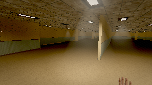

### 1:01.0 — intake exploring

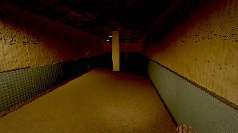

### 2:01.0 — intake exploring

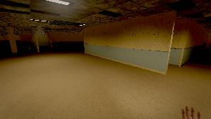

### 3:01.0 — service exploring

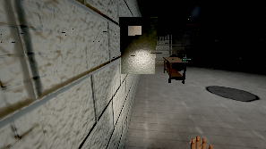

### 4:01.0 — service exploring

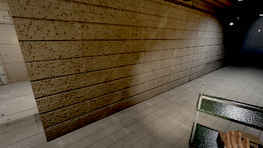

### 4:56.0 — LOST 25s in intake

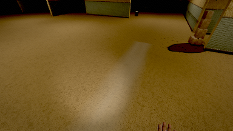

### 5:01.0 — intake exploring

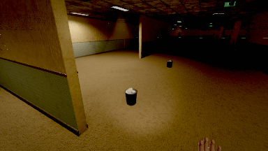

### 6:01.0 — intake exploring

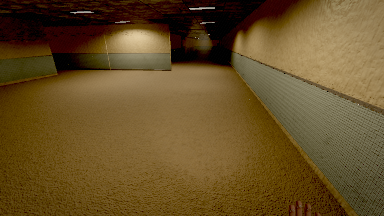

### 7:01.0 — intake exploring

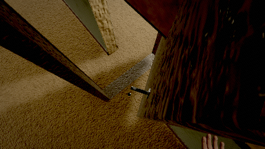

### 8:01.0 — intake exploring

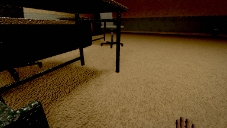

### 9:00.0 — final frame

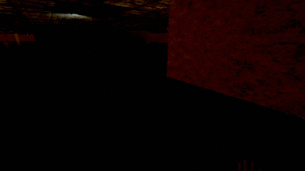

## What this tool cannot tell you

- It is a bot. It has no curiosity, cannot read a note, and does not form a hypothesis about
  where a corridor goes. A human is better at this and will get lost in different places.
- **A "cue" here is an interactable or a door, and nothing else.** Room plates, `STAFF ONLY`
  labels, wear paths worn into the lino, a lit corridor at the end of a dark one and the
  shape of the architecture itself are all navigational cues this tool is blind to. The
  cueless figure is therefore an **upper bound** on how lost a player would feel, not a
  measurement of it. What it is good for is comparison between zones and between builds.
- It steers on collision geometry, not on the rendered image, so a corridor that is visually
  unreadable but geometrically open reads as findable here. It cannot measure "too dark to
  navigate"; `tools/qa/emissive.mjs` and the capture harnesses do that.
- Frame times are SwiftShader and are not a frame-rate verdict.
- Coverage counts every walkable cell in a zone, including rooms behind doors this run never
  unlocked. It is "how much of the floor did it stand on", not "how much of the floor was
  reachable in this session". It is also a function of how long the session ran.
- One run is one route. The steering is seeded (`--seed`), so a run repeats; a *different*
  seed is a different walk and the numbers will move. Treat a single run as one playtester,
  not as the truth about the building.

## Checking the ruler

Two modes exist so that none of the above has to be taken on trust:

```
node tools/qa/explore.mjs --selftest
node tools/qa/explore.mjs --verify docs/verification/explore/explore.json
```

`--selftest` runs every metric function against states whose answers are known by
construction — including the two shapes this repo has shipped before: a coverage figure that
cannot go down, and a "longest quiet stretch" seeded with the whole session so that no real
gap can ever beat it (`docs/PLAYTEST_2026-07-31.md` §7). `--verify` re-derives every headline
number above from the stored record, confirms it reproduces, then truncates the session to
25/50/75 % and requires the coverage to fall and the lost time to change. A metric that does
not move when the session is cut in half is not measuring the session.
