# Playthrough filmstrip

33 frames from one continuous 447 s session, in order.
Read it as a sequence: what changes between two frames 15 s apart is the pacing.

### 0:00.5 — arrival — standing still, taking the room in

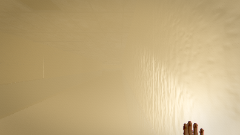

### 0:15.5 — first walk, no lamp

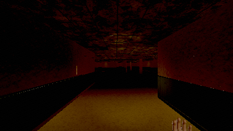

### 0:30.5 — first walk, no lamp

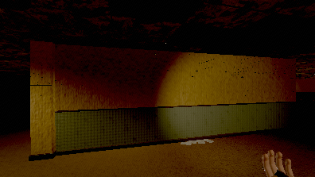

### 0:45.5 — lamp on

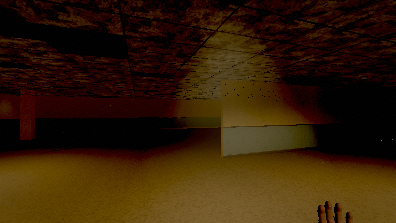

### 1:00.5 — lamp on

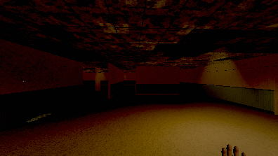

### 1:15.5 — stop and listen (lamp on)

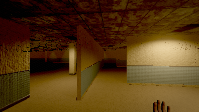

### 1:30.5 — crouch-walk — nearly silent

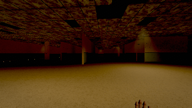

### 1:45.5 — crouch-walk — nearly silent

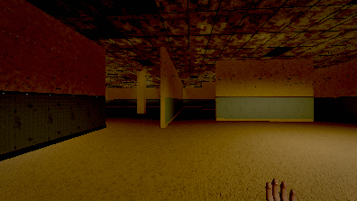

### 2:00.5 — sprint — deliberately loud

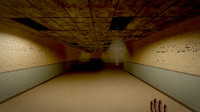

### 2:15.5 — walk on, lamp off (the entity only moves in light)

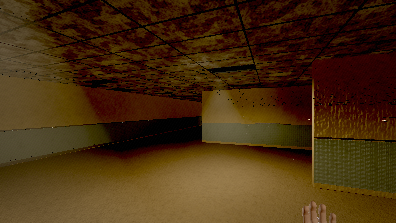

### 2:30.5 — walk on, lamp off (the entity only moves in light)

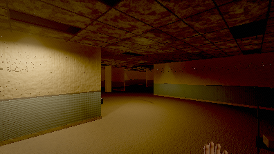

### 2:45.5 — stand in the dark and wait

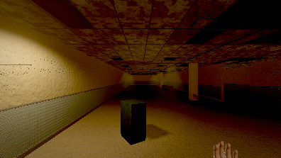

### 3:00.5 — stand in the dark and wait

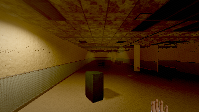

### 3:15.5 — sprint past it — loud enough to be heard

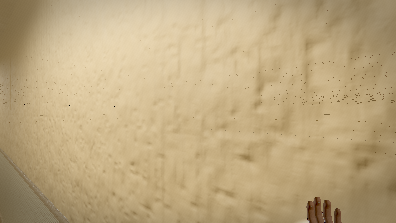

### 3:30.5 — sprint past it — loud enough to be heard

### 3:45.5 — lamp on and keep moving (it only advances in light)

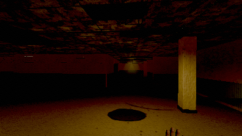

### 4:00.5 — lamp on and keep moving (it only advances in light)

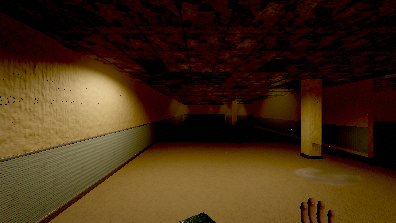

### 4:15.5 — stop, lamp off, stay still — does it lose you?

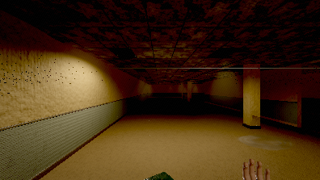

### 4:30.5 — stop, lamp off, stay still — does it lose you?

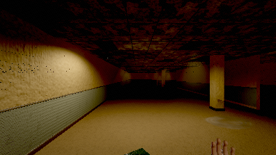

### 4:45.5 — stop, lamp off, stay still — does it lose you?

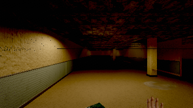

### 5:00.5 — walk to the service door

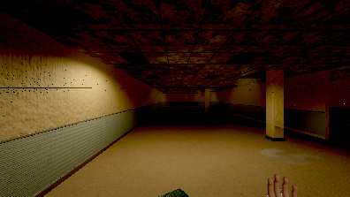

### 5:14.5 — enter service

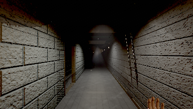

### 5:15.5 — service spine — first walk

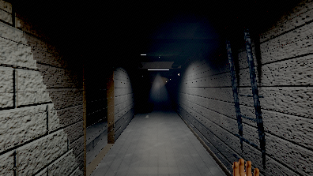

### 5:30.5 — service spine — first walk

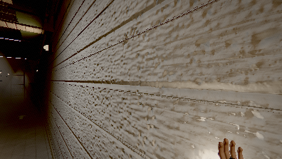

### 5:45.5 — service spine — first walk

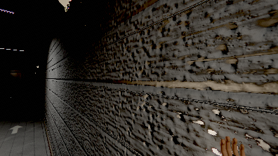

### 6:00.5 — service spine — sprint

### 6:06.0 — enter cistern

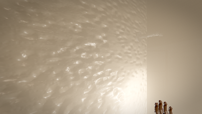

### 6:15.5 — cistern — wading

### 6:30.5 — cistern — wading

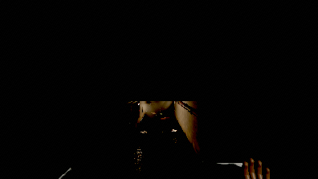

### 6:45.5 — cistern — stand still in the water

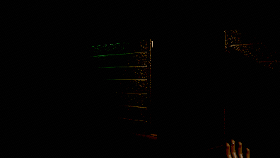

### 7:00.5 — cistern — stand still in the water

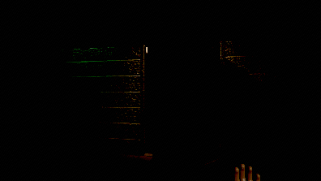

### 7:02.5 — enter safe

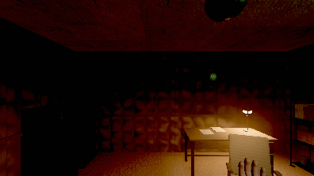

### 7:15.5 — the safe room

