# Playthrough filmstrip

20 frames from one continuous 623 s session, in order.
Read it as a sequence: what changes between two frames 15 s apart is the pacing.

### 0:00.5 — arrival — standing still, taking the room in

### 0:40.5 — INTERACT: take the nearest thing off the floor

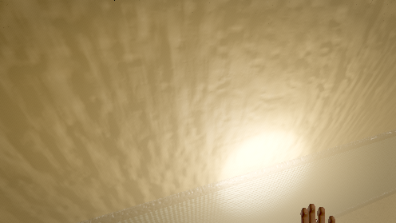

### 1:20.5 — stop and listen (lamp on)

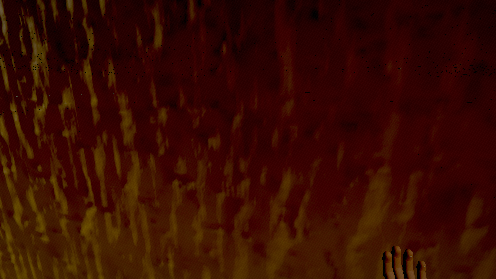

### 2:00.5 — INTERACT: get into the locker by the lift

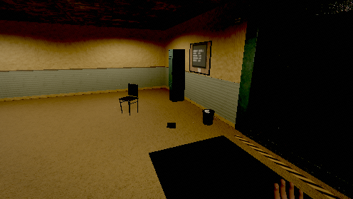

### 2:40.5 — sprint — deliberately loud

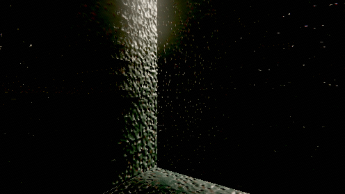

### 3:20.5 — stand in the dark and wait

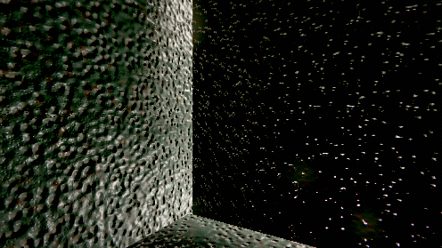

### 4:00.5 — lamp on and keep moving (it only advances in light)

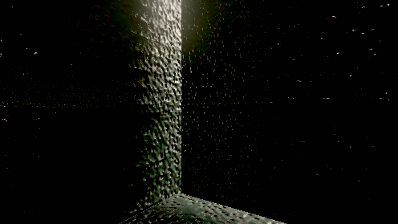

### 4:40.5 — stop, lamp off, stay still — does it lose you?

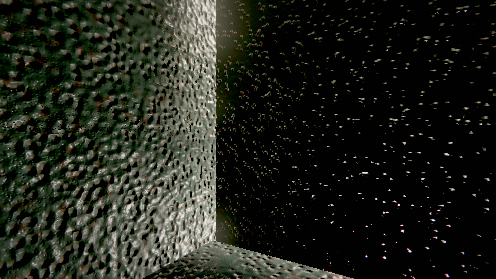

### 5:01.5 — enter service

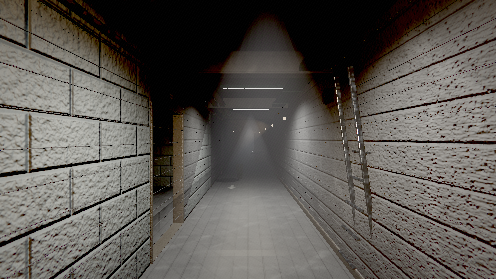

### 5:20.5 — service spine — first walk

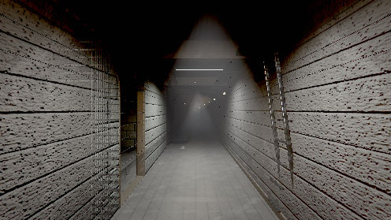

### 6:00.5 — INTERACT: read the board schedule off the floor

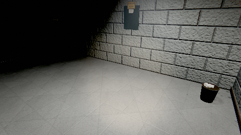

### 6:22.0 — enter cistern

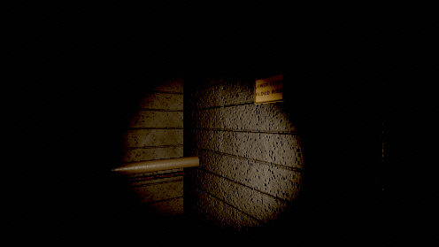

### 6:40.5 — cistern — wading

### 7:20.5 — INTERACT: try penstock 2 — it is padlocked

### 7:53.5 — enter plant

### 8:00.5 — the generator hall — the landmark frame

### 8:40.5 — INTERACT: try a socket with nothing in your hands

### 9:20.5 — INTERACT: call the goods lift — it has no supply

### 9:23.0 — enter safe

### 10:00.5 — INTERACT: the terminal

