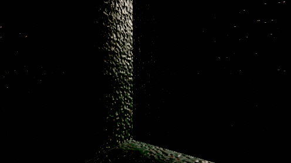
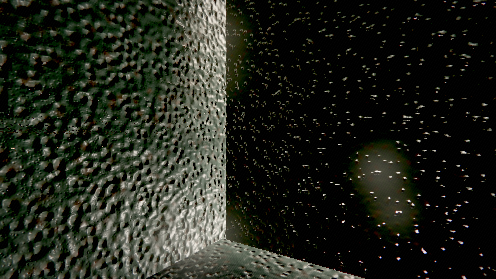
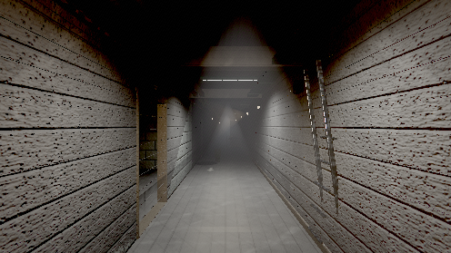
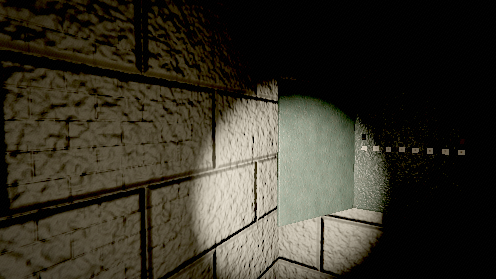
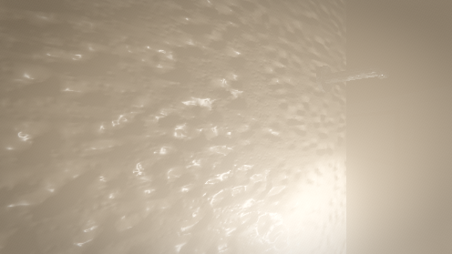
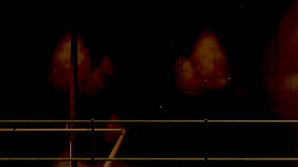
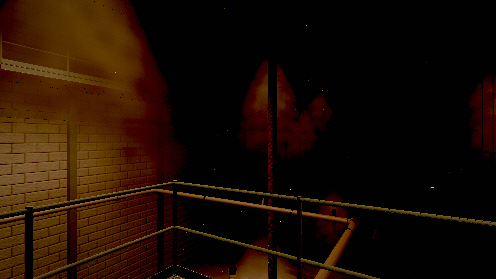
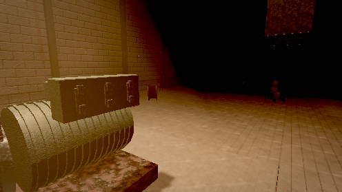
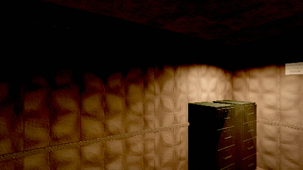
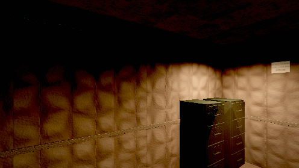

# Playthrough filmstrip

19 frames from one continuous 595 s session, in order.
Read it as a sequence: what changes between two frames 15 s apart is the pacing.

### 0:00.5 — arrival — standing still, taking the room in

### 0:40.5 — INTERACT: take the nearest thing off the floor

### 1:20.5 — stop and listen (lamp on)

### 2:00.5 — crouch-walk — nearly silent

### 2:40.5 — walk on, lamp off (the entity only moves in light)

### 3:20.5 — stand in the dark and wait

### 4:00.5 — lamp on and keep moving (it only advances in light)

### 4:40.5 — stop, lamp off, stay still — does it lose you?

### 4:52.5 — enter service

### 5:20.5 — service spine — first walk

### 6:00.5 — stand in the switchroom and look at what changed

### 6:13.5 — enter cistern

### 6:42.0 — INTERACT: turn penstock 1 (a 1.35 s hold)

### 7:22.0 — INTERACT: try penstock 2 — it is padlocked

### 7:45.0 — enter plant

### 8:02.0 — the generator hall — the landmark frame

### 8:42.0 — INTERACT: try a socket with nothing in your hands

### 9:14.5 — enter safe

### 9:22.0 — the safe room

