# Playthrough filmstrip

18 frames from one continuous 556 s session, in order.
Read it as a sequence: what changes between two frames 15 s apart is the pacing.

### 0:01.0 — arrival — standing still, taking the room in

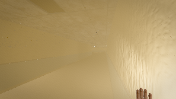

### 0:41.0 — INTERACT: take the nearest thing off the floor

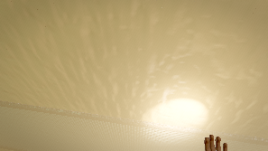

### 1:21.0 — stop and listen (lamp on)

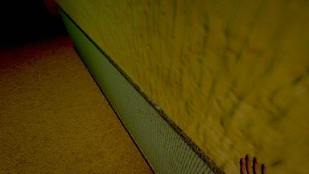

### 2:01.0 — inside the locker — two louvre slots and your own breathing

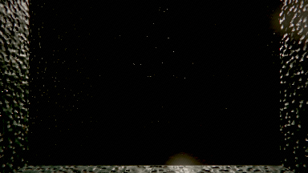

### 2:41.0 — sprint — deliberately loud

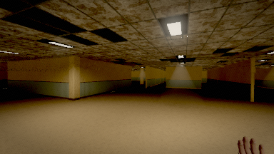

### 3:21.0 — stand in the dark and wait

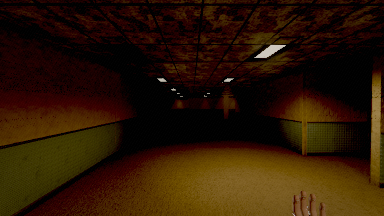

### 4:01.0 — sprint past it — loud enough to be heard

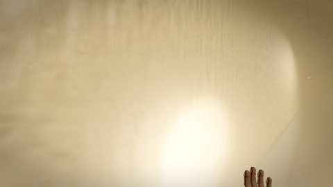

### 4:41.0 — stop, lamp off, stay still — does it lose you?

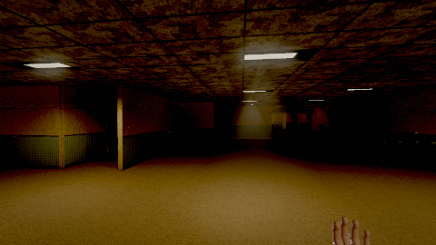

### 5:08.5 — enter service

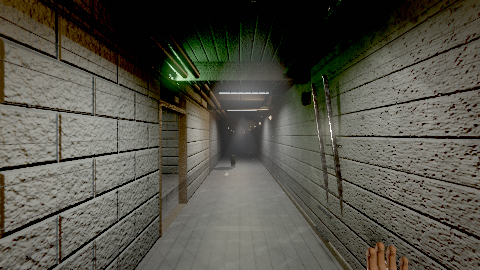

### 5:21.5 — service spine — first walk

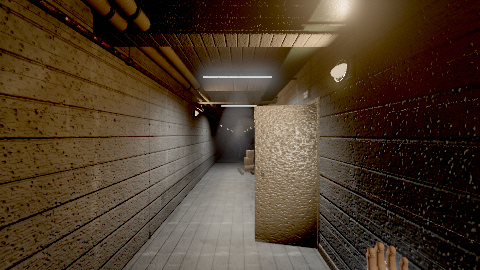

### 6:01.5 — stand in the switchroom and look at what changed

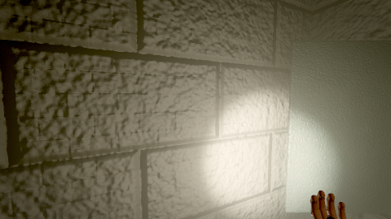

### 6:16.0 — enter cistern

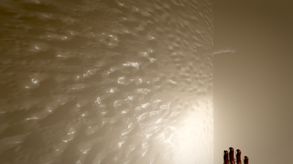

### 6:42.0 — cistern — wading

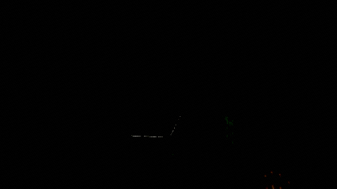

### 7:22.0 — cistern — stand still in the water

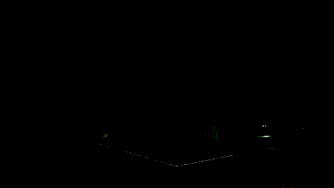

### 7:24.5 — enter plant

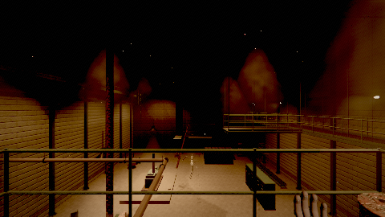

### 8:02.5 — INTERACT: try the fuel valve with no cores fitted

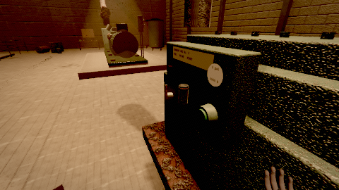

### 8:16.0 — enter safe

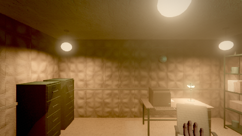

### 8:43.0 — INTERACT: the terminal

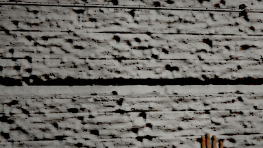
